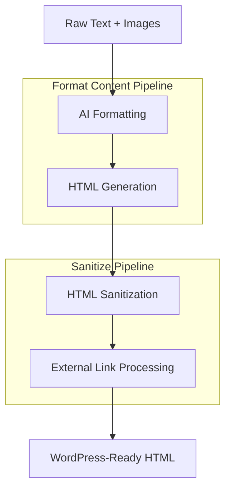
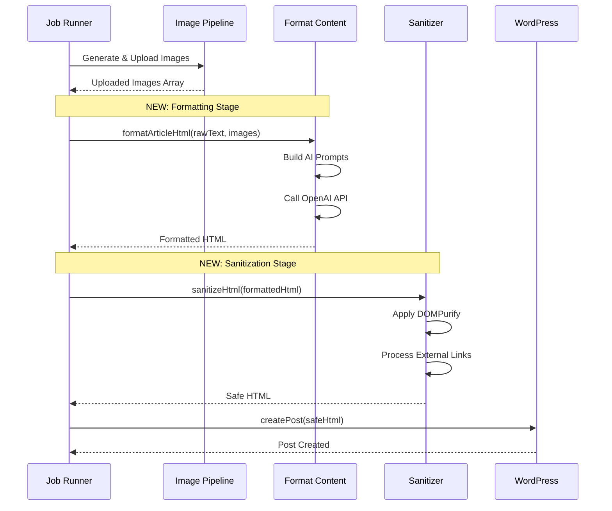
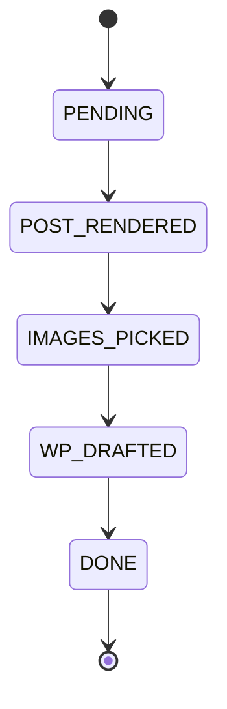
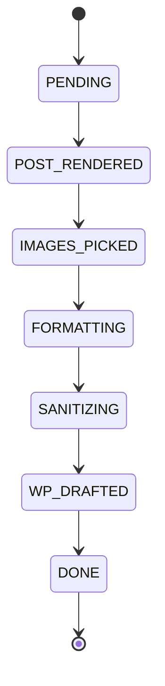
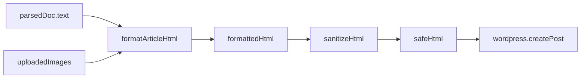

# Content Formatting Pipeline Integration

## Purpose

Integrate an AI-powered HTML formatting and sanitization pipeline into the existing job runner workflow. The pipeline transforms raw text content into clean, well-structured HTML suitable for WordPress publication, with automated image insertion, proper semantic markup, and security sanitization.

## Background

Currently, the job runner processes documents through parsing and image generation stages, but publishes raw text directly to WordPress. This results in poor formatting and manual editing requirements. The new formatting pipeline will automate the transformation of raw content into production-ready HTML.

## Objectives

| Objective | Description | Success Criteria |
|-----------|-------------|------------------|
| HTML Formatting | Transform raw text into structured HTML using AI | Generated HTML contains proper semantic tags, paragraph breaks, headings, and lists |
| Image Integration | Insert generated images into logical positions within content | Images wrapped in figure elements with captions and alt text |
| Security Sanitization | Remove potentially harmful HTML while preserving WordPress-compatible markup | Output passes DOMPurify validation with WordPress configuration |
| External Link Safety | Automatically secure external links | All external links contain target="_blank" and rel="noopener noreferrer" |
| Pipeline Integration | Seamlessly integrate into existing job runner workflow | Formatting occurs after image generation, before WordPress publication |

## System Architecture

### Pipeline Flow



### Integration Point in Job Runner



## Component Specifications

### Format Content Module

**Location**: `src/pipelines/format-content.ts`

**Primary Function**: `formatArticleHtml`

**Purpose**: Transform raw text into structured HTML with integrated images using OpenAI GPT.

**Input Parameters**:

| Parameter | Type | Description |
|-----------|------|-------------|
| rawText | string | Original unformatted article text |
| images | Array | Collection of uploaded images with metadata |
| images[].source_url | string | WordPress media URL for the image |
| images[].prompt | string | AI-generated description of image content |

**Output**: Promise resolving to HTML string

**AI Prompt Strategy**:

**System Prompt Instructions**:
- Role: "Expert web editor for WordPress content"
- Task: Transform raw text into clean HTML structure
- Formatting rules:
  - Break text into short paragraphs using `<p>` tags
  - Structure content with `<h2>` and `<h3>` headings
  - Format lists as `<ul>` or `<ol>` where appropriate
  - Insert provided images at logical positions
  - Wrap each image in `<figure>` element
  - Include `` with src and alt attributes
  - Add `<figcaption>` with descriptive text based on image prompt
- Constraints:
  - Output only body HTML content
  - Do not include `<html>`, `<body>`, or `<head>` tags
  - Content must be WordPress editor-ready

**User Prompt Structure**:
- Include full raw text of article
- Append JSON array of available images containing:
  - `source_url`: WordPress media URL
  - `prompt`: Description for alt text and caption generation

**OpenAI Configuration**:

| Setting | Value | Rationale |
|---------|-------|-----------|
| Model | gpt-4o-mini or gpt-4o | Balance of quality and cost |
| Temperature | Not specified | Use OpenAI default for consistency |
| Response Format | text/plain | Receiving HTML as string |

**Error Handling**:
- API authentication failures
- Rate limit exceeded scenarios
- Empty or invalid responses
- Network connectivity issues

### Sanitize Module Enhancement

**Location**: `src/pipelines/sanitize.ts`

**Primary Function**: `sanitizeHtml`

**Purpose**: Remove potentially harmful HTML while preserving WordPress-compatible markup and enhancing external link security.

**Current Implementation**: Basic DOMPurify sanitization with WordPress tag whitelist

**Required Enhancements**:

#### Attribute Whitelist Extension

**Current WORDPRESS_CONFIG**:
- Already includes comprehensive ALLOWED_TAGS
- ALLOWED_ATTR needs extension

**Addition Required**:
```
ADD_ATTR: ['target', 'rel']
```

**Rationale**: Enable safe external link handling with target and rel attributes

#### External Link Security Hook

**Implementation Approach**: DOMPurify afterSanitizeAttributes hook

**Hook Configuration**:

| Property | Value |
|----------|-------|
| Hook Type | afterSanitizeAttributes |
| Target Elements | All `<a>` tags |
| Trigger Condition | Element has href attribute |

**Link Classification Logic**:

| Link Type | Detection Criteria | Action |
|-----------|-------------------|--------|
| External Link | href starts with http:// or https:// AND domain differs from WordPress site | Add target="_blank" and rel="noopener noreferrer" |
| Internal Link | href is relative OR domain matches WordPress site | No modification |
| Anchor Link | href starts with # | No modification |
| Other Protocols | mailto:, tel:, etc. | No modification |

**Security Benefits**:

| Attribute | Purpose |
|-----------|---------|
| target="_blank" | Opens external links in new tab, preserving user's reading context |
| rel="noopener" | Prevents new page from accessing window.opener, mitigating reverse tabnabbing |
| rel="noreferrer" | Prevents referrer information leakage to external site |

**SEO Considerations**: External links with noopener/noreferrer maintain site authority while providing security

### Job Runner Integration

**Location**: `src/core/job-runner.ts`

**Integration Point**: After IMAGES_PICKED status, before WordPress post creation

**Current Workflow State Before Integration**:



**Workflow Enhancement**:



**Implementation Steps**:

#### Step 1: Import Required Modules

Add to imports section:
- `formatArticleHtml` from `../pipelines/format-content.js`
- `sanitizeHtml` from `../pipelines/sanitize.js`

#### Step 2: Formatting Stage

**Location**: After successful image upload and IMAGES_PICKED status update

**Process**:

| Action | Details |
|--------|---------|
| Input Preparation | Extract `parsedDoc.text` and `uploadedImages` array |
| Image Data Transformation | Map uploadedImages to format expected by formatter (source_url from url property, include prompt if available) |
| Function Call | Invoke `formatArticleHtml(rawText, imageData)` |
| Output Storage | Store result in variable `formattedHtml` |
| Logging | Log completion with message indicating formatting complete |

#### Step 3: Sanitization Stage

**Location**: Immediately after formatting stage

**Process**:

| Action | Details |
|--------|---------|
| Input | Pass `formattedHtml` from previous stage |
| Function Call | Invoke `sanitizeHtml(formattedHtml)` |
| Output Storage | Store result in variable `safeHtml` |
| Logging | Log completion with message indicating HTML sanitized |

#### Step 4: WordPress Post Creation Modification

**Current Implementation**:
- Creates post with `content: postContent` where postContent equals `parsedDoc.text`

**Required Change**:
- Replace content parameter with `content: safeHtml`

**Data Flow Visualization**:



## Data Structures

### Image Metadata for Formatting

**Input to formatArticleHtml**:

| Field | Type | Required | Description |
|-------|------|----------|-------------|
| source_url | string | Yes | WordPress media library URL |
| prompt | string | Yes | AI-generated image description for alt text and caption |

**Mapping from uploadedImages**:

Current uploadedImages structure:
- url: string
- alt: string
- wpMediaId: number
- prompt?: string (optional)

Transformation required:
- source_url ← url
- prompt ← prompt (if available, otherwise use alt)

### HTML Output Structure

**Expected HTML Elements**:

| Element | Usage | Example Attributes |
|---------|-------|-------------------|
| `<p>` | Paragraph text blocks | None |
| `<h2>` | Primary section headings | None |
| `<h3>` | Subsection headings | None |
| `<ul>` / `<ol>` | Unordered and ordered lists | None |
| `<li>` | List items | None |
| `<figure>` | Image container with caption | None |
| `` | Image element | src, alt |
| `<figcaption>` | Image caption | None |
| `<a>` | Links (internal and external) | href, target, rel |

**Sample Output Structure**:

```
<p>Article introduction text...</p>

<h2>Main Section Heading</h2>

<p>Section content...</p>

<figure>
  
  <figcaption>[Caption based on prompt]</figcaption>
</figure>

<p>More content...</p>

<ul>
  <li>List item one</li>
  <li>List item two</li>
</ul>
```

## Error Handling Strategy

### Format Content Errors

| Error Scenario | Detection | Recovery Strategy |
|----------------|-----------|-------------------|
| OpenAI API Failure | API call throws exception | Log error, consider fallback to basic HTML wrapping |
| Rate Limit Exceeded | 429 status code | Retry with exponential backoff or fail job gracefully |
| Authentication Failure | 401 status code | Fail job with clear error message about API key |
| Empty Response | Response content is null or empty | Log error, consider using original text |
| Invalid Images Array | Images parameter malformed | Proceed with formatting, exclude images |

### Sanitization Errors

| Error Scenario | Detection | Recovery Strategy |
|----------------|-----------|-------------------|
| DOMPurify Exception | Sanitize call throws | Log error, return original HTML or fail job |
| Malformed HTML Input | Invalid HTML structure | DOMPurify will clean it, log warning |
| Hook Registration Failure | addHook throws exception | Continue with basic sanitization without hook |

### Job Runner Integration Errors

| Error Scenario | Detection | Recovery Strategy |
|----------------|-----------|-------------------|
| Formatting Failure | formatArticleHtml throws | Catch error, log, fall back to raw text or fail job |
| Sanitization Failure | sanitizeHtml throws | Catch error, log, use formatted but unsanitized HTML or fail |
| Missing Images Data | uploadedImages undefined or empty | Pass empty array to formatter |

**Error Propagation**: All errors should be logged with context and propagate to existing job runner error handling mechanism

## Configuration

### Environment Variables

**Existing Variables Used**:

| Variable | Purpose | Used By |
|----------|---------|---------|
| OPENAI_API_KEY | OpenAI authentication | format-content.ts |
| OPENAI_MODEL | Model selection (gpt-4o-mini or gpt-4o) | format-content.ts |

**No New Variables Required**

### OpenAI Model Selection

**Recommendation**: Use gpt-4o-mini as default for cost efficiency

**Configuration Approach**:
- Check environment variable OPENAI_MODEL
- Default to gpt-4o-mini if not specified
- Allow gpt-4o for higher quality if needed

**Cost Considerations**:

| Model | Cost Profile | Use Case |
|-------|--------------|----------|
| gpt-4o-mini | Lower cost | Standard article formatting, high volume |
| gpt-4o | Higher cost | Premium content requiring better structure |

## Logging Strategy

### Format Content Logging

**Log Points**:

| Event | Level | Message Content |
|-------|-------|----------------|
| Start Formatting | info | "Starting article HTML formatting for job [jobId]" |
| OpenAI Request | info | "Calling OpenAI API with model [model]" |
| OpenAI Success | info | "Received formatted HTML from OpenAI, length: [bytes]" |
| OpenAI Error | error | "OpenAI formatting failed: [error message]" |
| Formatting Complete | info | "Article formatting completed successfully" |

### Sanitization Logging

**Log Points**:

| Event | Level | Message Content |
|-------|-------|----------------|
| Start Sanitization | info | "Starting HTML sanitization for job [jobId]" |
| External Links Processed | info | "Processed [count] external links for security" |
| Sanitization Complete | info | "HTML sanitization completed" |
| Sanitization Error | error | "Sanitization failed: [error message]" |

### Job Runner Integration Logging

**Log Points**:

| Event | Level | Message Content |
|-------|-------|----------------|
| Before Formatting | info | "Starting content formatting stage for job [jobId]" |
| After Formatting | info | "Content formatted successfully, HTML length: [bytes]" |
| Before Sanitization | info | "Starting HTML sanitization stage for job [jobId]" |
| After Sanitization | info | "HTML sanitized and ready for WordPress" |
| WordPress Post Creation | info | "Creating WordPress post with formatted content" |

## Quality Assurance

### Validation Criteria

**Formatted HTML Quality**:

| Criterion | Validation Method |
|-----------|-------------------|
| Well-formed HTML | Parse with HTML parser, check for errors |
| Images Present | Count figure elements matches input images count |
| Semantic Structure | Verify presence of headings, paragraphs, lists |
| No Unwanted Tags | Ensure no html, body, head tags present |
| Alt Text Present | All img tags have alt attribute |

**Sanitized HTML Quality**:

| Criterion | Validation Method |
|-----------|-------------------|
| Only Allowed Tags | Verify DOMPurify removed unauthorized tags |
| External Links Secured | Check all external links have target and rel |
| XSS Prevention | Confirm no script tags or event handlers |
| WordPress Compatibility | All tags in WordPress allowed list |

### Testing Approach

**Unit Testing**:
- Test formatArticleHtml with various text inputs
- Test sanitizeHtml with malicious HTML samples
- Test external link detection logic

**Integration Testing**:
- Run full job with real Google Doc
- Verify HTML in WordPress draft post
- Confirm images appear in content
- Validate external links open correctly

**Edge Cases**:

| Scenario | Expected Behavior |
|----------|-------------------|
| No images available | Format text-only content |
| Very short text | Still apply basic formatting |
| Text with existing HTML | Strip and reformat cleanly |
| All external links | All get security attributes |
| Mixed internal/external links | Only external links modified |
| Malformed image URLs | Skip problematic images, log warning |

## Performance Considerations

### OpenAI API Latency

**Expected Duration**: 3-10 seconds per formatting request

**Impact on Job Runtime**:
- Current job includes image generation (multiple API calls)
- Formatting adds one additional API call
- Total additional time: 3-10 seconds per job

**Optimization Opportunities**:
- None required at current scale
- Future: Consider caching for similar content

### Memory Usage

**HTML Processing**:
- DOMPurify operates on DOM in memory
- Text content typically under 50KB
- Generated HTML typically under 100KB
- Memory impact negligible

### API Rate Limits

**OpenAI Limits**:
- Depends on account tier
- Standard tier: 3,500 requests/minute for gpt-4o-mini
- Current usage pattern: 1 request per job

**Mitigation**: Current job volume well within limits

## Dependencies

### New Package Requirements

**None**: All required packages already in project dependencies

**Existing Dependencies Used**:

| Package | Current Version | Usage |
|---------|----------------|-------|
| openai | Latest | AI-powered HTML formatting |
| dompurify | Latest | HTML sanitization |
| jsdom | Latest | DOM implementation for Node.js (DOMPurify dependency) |

### Module Dependencies

**format-content.ts dependencies**:
- openai package
- logger module from src/core/logger.ts

**sanitize.ts dependencies**:
- dompurify package
- jsdom package

**job-runner.ts new dependencies**:
- src/pipelines/format-content.ts
- src/pipelines/sanitize.ts

## Migration Strategy

### Backward Compatibility

**Impact**: This change modifies WordPress post content format

**Compatibility Considerations**:
- Existing drafts created before this change will have raw text
- New drafts will have formatted HTML
- Both formats accepted by WordPress

**No Migration Required**: Change applies only to new jobs

### Rollback Plan

**If formatting causes issues**:
- Comment out formatting and sanitization stages
- Revert to direct use of parsedDoc.text
- Existing job runner flow remains intact

**Configuration-based Toggle** (optional enhancement):
- Add environment variable ENABLE_HTML_FORMATTING
- Default to true
- Set to false to disable formatting pipeline

## Future Enhancements

### Potential Improvements

| Enhancement | Description | Priority |
|-------------|-------------|----------|
| Custom Templates | Allow different HTML structures based on content type | Low |
| A/B Testing | Compare formatted vs raw content performance | Medium |
| Image Position Control | Allow configuration of where images should appear | Low |
| Multi-language Support | Format content in languages other than English | Medium |
| Style Injection | Add custom CSS classes for WordPress theme compatibility | Low |
| Content Optimization | SEO-focused content analysis and suggestions | Low |

### Scalability Considerations

**Current Design**: Synchronous processing per job

**Future Scale Scenarios**:
- If job volume increases significantly, consider parallel processing
- If formatting becomes bottleneck, consider batching requests
- If costs increase, evaluate cheaper model options

## Success Metrics

### Functional Success

| Metric | Target | Measurement Method |
|--------|--------|-------------------|
| Job Completion Rate | >95% with formatting enabled | Monitor error logs and job status |
| HTML Validity | 100% of formatted content is valid HTML | Automated validation in tests |
| Image Insertion | All uploaded images appear in formatted content | Verify figure count matches image count |
| External Link Security | 100% of external links have security attributes | Automated verification script |

### Quality Success

| Metric | Target | Measurement Method |
|--------|--------|-------------------|
| Manual Editing Required | <20% of posts require editing after formatting | User feedback tracking |
| WordPress Compatibility | 100% of posts render correctly in WordPress | Visual inspection |
| Formatting Consistency | Consistent structure across different content types | Sample review |

### Performance Success

| Metric | Target | Measurement Method |
|--------|--------|-------------------|
| Formatting Duration | <10 seconds per job | Job execution timing logs |
| API Failures | <1% of formatting requests fail | Error rate monitoring |
| Job Runtime Increase | <20% increase in total job time | Compare before/after metrics |

## Implementation Sequence

### Phase 1: Format Content Implementation

1. Implement formatArticleHtml function in src/pipelines/format-content.ts
2. Add OpenAI client initialization
3. Construct system and user prompts
4. Implement API call and response handling
5. Add error handling and logging

### Phase 2: Sanitize Enhancement

1. Update WORDPRESS_CONFIG to include target and rel in ADD_ATTR
2. Implement afterSanitizeAttributes hook
3. Add external link detection logic
4. Apply security attributes to external links
5. Test with various HTML samples

### Phase 3: Job Runner Integration

1. Add imports for formatArticleHtml and sanitizeHtml
2. Locate integration point after IMAGES_PICKED status
3. Add formatting stage with logging
4. Add sanitization stage with logging
5. Modify WordPress post creation to use safeHtml
6. Test complete job execution flow

### Phase 4: Testing and Validation

1. Unit test formatting with sample texts
2. Unit test sanitization with malicious HTML
3. Integration test with real Google Doc
4. Validate WordPress post output
5. Verify external link security

## Risk Assessment

| Risk | Probability | Impact | Mitigation |
|------|------------|--------|------------|
| OpenAI API outages | Low | High | Implement retry logic and fallback to raw text |
| Formatting quality issues | Medium | Medium | Allow manual editing in WordPress, monitor feedback |
| Increased job failures | Low | Medium | Comprehensive error handling and logging |
| Cost increases from API usage | Low | Low | Monitor usage, optimize prompts, use cheaper model |
| Security vulnerabilities in sanitization | Very Low | High | Use well-tested DOMPurify library, regular updates |
| Performance degradation | Low | Low | Monitor job execution times, optimize if needed || Security vulnerabilities in sanitization | Very Low | High | Use well-tested DOMPurify library, regular updates |
