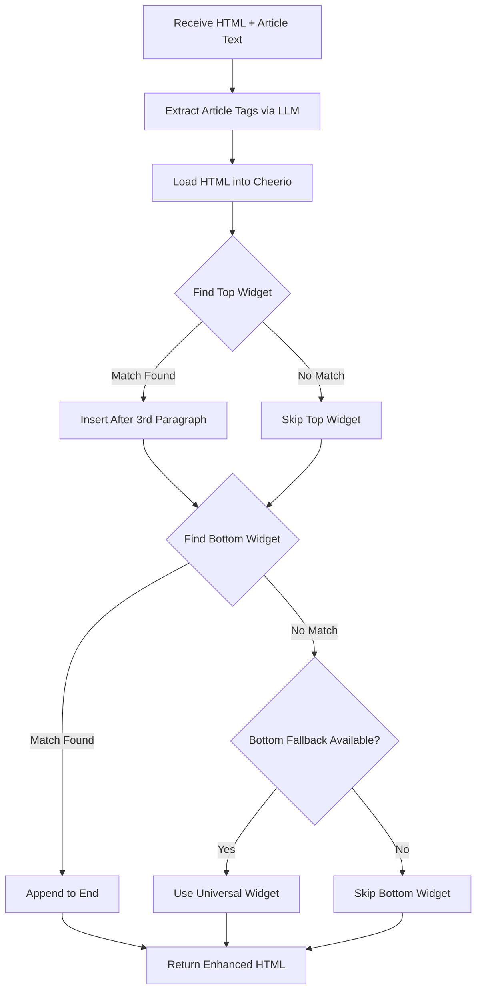

# Content Pipeline Updates: Widget Insertion and Image Styling

## Overview

Enhancement of the content formatting pipeline to improve widget placement logic, image styling, and caption formatting for professional WordPress output.

## Objectives

1. Implement intelligent widget insertion with fallback support
2. Add HTML manipulation capabilities using Cheerio
3. Enhance image formatting with CSS classes and semantic markup
4. Generate Russian-language captions for images
5. Ensure professional WordPress-compatible output

## Scope

### In Scope
- Widget insertion logic improvements in `src/pipelines/widgets.ts`
- HTML prompt refinement in `src/pipelines/format-content.ts`
- Addition of Cheerio dependency for DOM manipulation
- Fallback widget selection mechanism
- Image wrapping with `<figure>` and `<figcaption>` tags
- CSS class application for image alignment

### Out of Scope
- Changes to widget configuration schema
- Modifications to image generation logic
- WordPress API integration changes
- Database schema modifications

## Current State Analysis

### Existing Widget System
The current implementation:
- Extracts article tags using LLM
- Matches widgets based on topic overlap with article tags
- Injects widget HTML at the beginning (top) or end (bottom) of content
- Returns original HTML if widget matching fails

**Limitations:**
- No fallback when no topic match is found
- Simple string concatenation (no DOM awareness)
- Top widget always inserted at absolute beginning
- No consideration of content structure for placement

### Existing Formatting System
The current implementation:
- Uses OpenAI GPT for HTML formatting
- Accepts raw text and image array
- Generic instructions for image insertion
- Basic `<figure>` and `<figcaption>` guidance

**Limitations:**
- No specific CSS class instructions for images
- English prompts may leak into captions
- No guidance on caption language or style
- Limited image alignment control

## Design Solution

### 1. Enhanced Widget Insertion Pipeline

#### Strategy
Replace simple string concatenation with DOM-aware insertion using Cheerio library.

#### Widget Selection Algorithm

**Matching Process:**

| Step | Action | Logic |
|------|--------|-------|
| 1 | Filter by position | Narrow candidates to 'top' or 'bottom' widgets |
| 2 | Calculate tag scores | Count tag overlaps between article and widget |
| 3 | Select best match | Choose widget with highest score |
| 4 | Apply fallback | If no match for 'bottom', use default universal widget |

**Fallback Mechanism:**

For bottom position only:
- If no widget has matching tags (score = 0), select a predefined universal widget
- Universal widget ID must be configured
- Top position has no fallback (remains optional)

#### Widget Placement Logic

**Top Widget Placement:**
- Target: After 3rd paragraph
- Implementation: Use Cheerio to select paragraph elements
- Condition: If fewer than 3 paragraphs exist, prepend to content root
- Format: Insert widget script as standalone block with line breaks

**Bottom Widget Placement:**
- Target: End of content
- Implementation: Append to root element
- Format: Insert widget script as standalone block with line breaks

#### Technical Flow



#### Configuration Requirements

**Universal Widget Identification:**
- Widget ID must be specified in code
- Widget must exist in widgets data source
- Widget must have position set to 'bottom'
- Suggested property name: `УНИВЕРСАЛЬНЫЙ_ID_ДЛЯ_НИЗА` (placeholder to be replaced)

**Field Mapping:**
- Current field: `topics` (array of strings)
- Expected field in user request: `tags` (array of strings)
- **Resolution:** Continue using `topics` field from existing schema, as code logic refers to `widget.topics`

### 2. Enhanced HTML Formatting with Image Styling

#### OpenAI Prompt Enhancement

**New Instructions:**

| Category | Requirement | Details |
|----------|-------------|---------|
| Image Container | Use `<figure>` wrapper | Semantic HTML5 element for media content |
| CSS Classes | Apply alignment classes | `aligncenter`, `alignleft`, `alignright` |
| Default Alignment | Center alignment | Use `aligncenter` for most images |
| Size Hint | Add size class | `size-large` for WordPress compatibility |
| Image Tag | Require `alt` attribute | Based on generation prompt content |
| Caption | Use `<figcaption>` | Inside `<figure>`, after `` |
| Caption Language | Russian only | Translate/describe in Russian |
| Caption Style | Short and descriptive | Reader-facing description, not technical prompt |

**Example Output Structure:**

```
<figure class="aligncenter size-large">
  
  <figcaption>[Short Russian description for readers]</figcaption>
</figure>
```

#### Prompt Template Structure

**System Message:**
- Role definition: Expert web editor for WordPress
- Primary task: Format text into clean HTML
- Output constraint: Body content only, no document tags

**Formatting Rules Section:**
- Paragraph breaking with `<p>` tags
- Heading hierarchy with `<h2>` and `<h3>`
- List formatting with `<ul>` or `<ol>`

**Image Insertion Rules Section (Detailed):**
1. Logical placement within content flow
2. `<figure>` wrapping requirement
3. CSS class specification with examples
4. `alt` attribute requirement
5. `<figcaption>` requirement
6. Caption language and style guidelines
7. Explicit prohibition on using English prompts as captions

**Constraints Section:**
- HTML body content only
- No document structure tags
- WordPress editor compatibility

### 3. Dependency Addition

#### New Dependency: Cheerio

**Purpose:** Server-side DOM manipulation and traversal

**Packages:**
- `cheerio` - Core library
- `@types/cheerio` - TypeScript type definitions

**Usage Context:**
- Parse HTML string into manipulable document object
- Query elements using CSS selectors
- Insert content at specific positions
- Serialize back to HTML string

**Configuration:**
- Option: `decodeEntities: false` to preserve HTML entities

## Implementation Checklist

| Task | File | Action |
|------|------|--------|
| Install Cheerio | Terminal | Run `npm install cheerio @types/cheerio` |
| Update widget logic | `src/pipelines/widgets.ts` | Replace with enhanced implementation |
| Update formatting prompt | `src/pipelines/format-content.ts` | Replace systemPrompt variable content |
| Configure fallback ID | `src/pipelines/widgets.ts` | Set universal widget ID constant |
| Verify widget schema | Data source | Confirm `topics` field exists in all widgets |

## Technical Considerations

### Widget Selection Edge Cases

**Scenario: Multiple widgets with same score**
- Resolution: First match wins (deterministic based on array order)
- Impact: Predictable behavior, no randomization

**Scenario: No bottom widgets defined**
- Resolution: Fallback logic checks for empty array, returns null
- Impact: No error, graceful degradation

**Scenario: Universal widget ID not found**
- Resolution: Returns null, no widget inserted
- Impact: Content published without bottom widget

### Image Formatting Edge Cases

**Scenario: No images provided**
- Current behavior: LLM formats text only
- Expected behavior: Same, no change required

**Scenario: More images than logical positions**
- LLM decision: Select subset based on relevance
- Impact: Some images may be omitted

**Scenario: Image prompt in non-English language**
- Alt attribute: Keep original prompt language
- Figcaption: Always Russian per requirement

### WordPress Compatibility

**CSS Classes:**
- `aligncenter`, `alignleft`, `alignright` - WordPress core alignment classes
- `size-large` - WordPress core size class
- Expected behavior: Automatic styling via theme CSS

**Figure Element:**
- HTML5 semantic element
- WordPress Gutenberg compatible
- Classic editor compatible

## Testing Strategy

### Widget Insertion Testing

**Test Case 1: Tag Match Found**
- Input: Article with tags matching widget topics
- Expected: Matched widget inserted at correct position

**Test Case 2: No Tag Match**
- Input: Article with no overlapping tags
- Expected: Universal bottom widget inserted (if configured)

**Test Case 3: Short Article (< 3 paragraphs)**
- Input: Article with 1-2 paragraphs
- Expected: Top widget prepended to content

**Test Case 4: Long Article (> 3 paragraphs)**
- Input: Article with 5+ paragraphs
- Expected: Top widget inserted after 3rd paragraph

### Image Formatting Testing

**Test Case 1: Image with English Prompt**
- Input: Image with prompt "A serene mountain landscape"
- Expected:
  - `alt="A serene mountain landscape"`
  - `<figcaption>Горный пейзаж</figcaption>` (or similar Russian description)

**Test Case 2: Multiple Images**
- Input: 3 images with different prompts
- Expected: All wrapped in `<figure>` with Russian captions

**Test Case 3: Alignment Variation**
- Input: Multiple images in long article
- Expected: Mix of alignment classes (left, right, center)

### Integration Testing

**End-to-End Flow:**
1. Process article with raw text and images
2. Format HTML with enhanced prompt
3. Insert widgets with Cheerio logic
4. Verify final HTML structure
5. Confirm WordPress compatibility

## Success Criteria

| Metric | Target | Validation Method |
|--------|--------|-------------------|
| Widget placement accuracy | 100% for articles > 3 paragraphs | Manual inspection |
| Fallback widget usage | Triggered when no tag match | Log verification |
| Image wrapping | All images in `<figure>` tags | HTML parsing check |
| Caption language | 100% Russian captions | Manual review |
| CSS class presence | All images have alignment classes | HTML parsing check |
| WordPress compatibility | No rendering errors | WordPress preview test |

## Risks and Mitigations

| Risk | Impact | Mitigation |
|------|--------|------------|
| Universal widget ID not configured | No fallback widget inserted | Document configuration requirement clearly |
| Cheerio parsing fails | Widget insertion breaks | Wrap in try-catch, return original HTML |
| LLM ignores caption language instruction | English captions appear | Add explicit examples in prompt |
| Widget script conflicts with Cheerio | Malformed HTML output | Use `decodeEntities: false` option |

## Configuration Notes

### Required Configuration

**Environment Variables:**
- No new variables required
- Existing `OPENAI_API_KEY` must remain valid

**Code Configuration:**
```
Location: src/pipelines/widgets.ts
Constant: УНИВЕРСАЛЬНЫЙ_ID_ДЛЯ_НИЗА
Purpose: Fallback widget ID for bottom position
Type: string
Example: 'universal-cta-bottom'
```

### Widget Data Requirements

**Schema Validation:**
- All widgets must have `position` field ('top' or 'bottom')
- All widgets must have `topics` array
- Universal widget must exist in data source
- Universal widget must have `embed_html` field

## Future Enhancements

**Potential Improvements (Out of Scope):**
- Dynamic widget position based on article length
- Multi-widget insertion (multiple positions)
- Widget A/B testing support
- Image lazy loading attributes
- Responsive image srcset generation
- Caption auto-generation from image analysis
