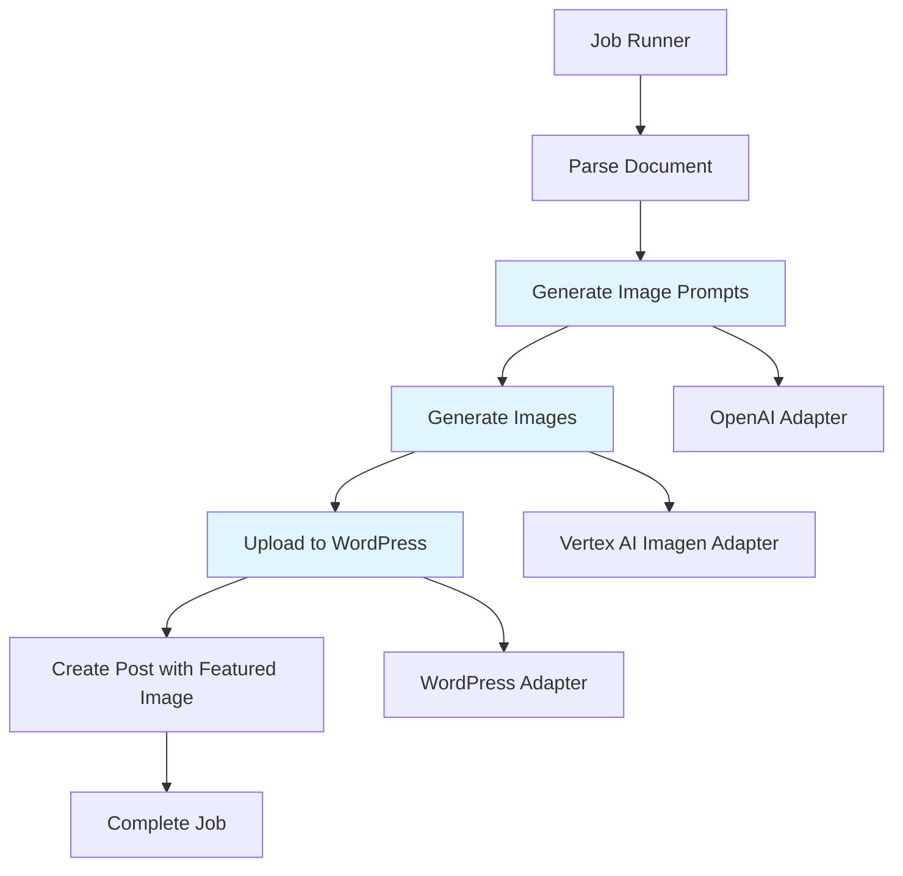
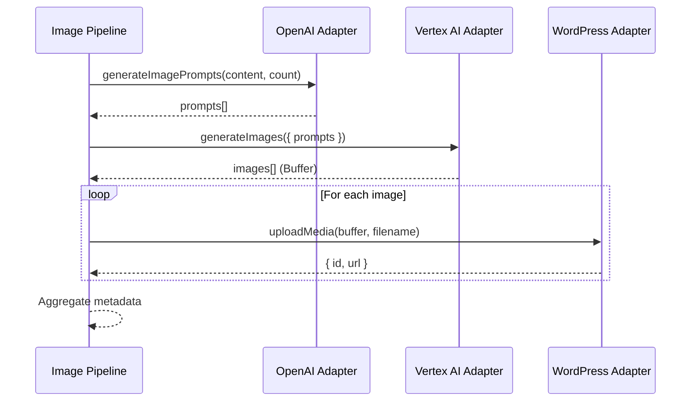
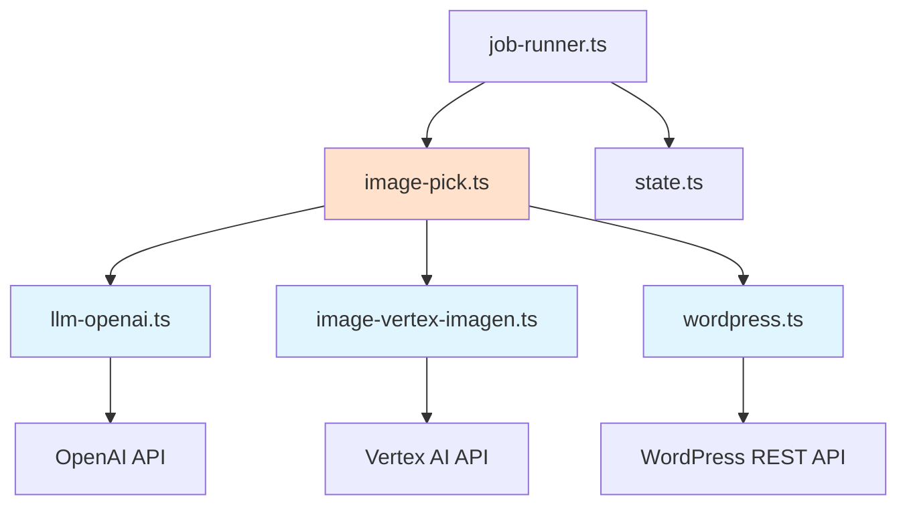

# Image Generation and Upload Pipeline

## Objective

Implement a complete AI-driven image generation pipeline that analyzes article text, generates contextual image prompts using OpenAI, creates images using Google Vertex AI Imagen, and uploads them to WordPress as media assets with proper metadata tracking.

## Scope

### In Scope
- Text analysis and image prompt generation via OpenAI API
- Image generation using Google Vertex AI Imagen service
- WordPress media upload functionality with multipart/form-data
- Pipeline orchestration for end-to-end image workflow
- Integration with existing job runner workflow
- Featured image assignment to WordPress posts

### Out of Scope
- Embedding images within post content body (future iteration)
- Image upscaling or post-processing
- Multiple aspect ratio support
- Image selection/ranking algorithms
- Retry logic for failed generations

## System Context

This feature extends the existing automated content pipeline that processes Google Docs files and publishes them to WordPress. The system currently:
- Polls Google Drive for new documents
- Parses document content into text and HTML
- Creates WordPress draft posts

The new image generation capability fills the gap between content parsing and post creation, enriching articles with AI-generated visuals.

## Architecture Overview



## Component Design

### 1. OpenAI Prompt Generator

**Location:** `src/adapters/llm-openai.ts`

**Purpose:** Analyze article text and generate visual scene descriptions suitable for image generation.

**Function Signature:**
```
generateImagePrompts(articleText: string, count: number = 3): Promise<string[]>
```

**Behavior:**

| Step | Action | Details |
|------|--------|---------|
| 1 | Text Truncation | Extract first 500-700 words to stay within token limits |
| 2 | Prompt Construction | Build system instruction requesting visual scene descriptions in English |
| 3 | API Call | Send request to OpenAI API with JSON response format |
| 4 | Response Parsing | Extract array of prompt strings from JSON response |
| 5 | Validation | Ensure returned array contains requested number of prompts |

**Input Constraints:**
- Article text should be at least 100 words for meaningful analysis
- Count parameter should be between 1 and 5 images
- Text truncation ensures compliance with OpenAI token limits (approximately 2000 tokens)

**Output Format:**
Array of English-language scene descriptions, each 1-2 sentences, describing concrete visual elements suitable for image generation.

**Example Output:**
```
[
  "A scientist examining a glowing DNA helix in a dimly lit laboratory",
  "Abstract visualization of interconnected neural networks with vibrant blue and purple nodes",
  "Modern office workspace with natural light and collaborative team discussion"
]
```

**Error Handling:**
- API authentication failures should throw descriptive errors
- Rate limiting should be logged and propagated
- Invalid JSON responses should be caught and re-requested or logged

**Configuration Requirements:**
- OpenAI API key from environment: `OPENAI_API_KEY`
- Model selection: use GPT-4 or GPT-3.5-turbo based on configuration
- Temperature: 0.7 for creative but controlled output

---

### 2. Vertex AI Image Generator

**Location:** `src/adapters/image-vertex-imagen.ts`

**Purpose:** Generate images from text prompts using Google Cloud Vertex AI Imagen model.

**Dependencies:**
- New package required: `@google-cloud/aiplatform`
- Authentication via Google Service Account (already configured in project)

**Function Enhancement:**

The existing `generateImages` function should be fully implemented with the following behavior:

**Input Parameters:**
```
{
  prompts: string[],           // Array of text descriptions
  model: string = 'imagegeneration@005',  // Imagen model version
  aspectRatio: string = '1:1'  // Image dimensions
}
```

**Processing Flow:**

| Step | Action | Details |
|------|--------|---------|
| 1 | Authentication | Initialize Vertex AI client using service account credentials |
| 2 | Batch Preparation | Prepare prediction requests for each prompt |
| 3 | API Invocation | Call Vertex AI Imagen endpoint for each prompt |
| 4 | Response Handling | Extract base64-encoded image data from prediction responses |
| 5 | Decoding | Convert base64 strings to Buffer objects |
| 6 | Result Aggregation | Combine all buffers with corresponding prompts |

**Output Format:**
```
Array<{
  prompt: string,      // Original text prompt
  imageUrl: string,    // Empty for now (placeholder)
  imageData: Buffer    // Binary image data
}>
```

**Authentication Details:**
- Service account JSON should be loaded from environment variable `GOOGLE_SERVICE_ACCOUNT_JSON`
- Project ID from `VERTEX_PROJECT_ID` environment variable
- Location/region from `VERTEX_LOCATION` (default: `us-central1`)

**Error Scenarios:**
- Invalid service account credentials → throw authentication error
- Model quota exceeded → log and throw quota error
- Invalid prompt (safety filters) → log warning, return null for that image
- Network timeout → retry once, then throw

**Performance Considerations:**
- Each image generation takes 10-30 seconds
- Process prompts sequentially to avoid quota issues
- Consider implementing parallel requests in future iterations

---

### 3. WordPress Media Uploader

**Location:** `src/adapters/wordpress.ts`

**Purpose:** Upload image files to WordPress Media Library via REST API.

**Dependencies:**
- New package required: `form-data`

**Function Implementation:**

The existing `uploadMedia` function stub should be completed with full functionality.

**Function Signature:**
```
uploadMedia(fileBuffer: Buffer, filename: string): Promise<UploadMediaResponse>
```

**Response Interface:**
```
{
  id: number,        // WordPress media attachment ID
  url: string        // Public URL of uploaded image
}
```

**Implementation Details:**

| Step | Action | Technical Details |
|------|--------|-------------------|
| 1 | Create FormData | Instantiate form-data object |
| 2 | Append File | Add buffer with filename and content-type (image/png) |
| 3 | Build Headers | Merge FormData headers with Basic Auth credentials |
| 4 | POST Request | Send to `/wp-json/wp/v2/media` endpoint |
| 5 | Extract Response | Parse media ID and source URL from response body |

**HTTP Request Specifications:**

**Endpoint:** `POST /wp-json/wp/v2/media`

**Headers:**
- `Authorization`: Basic authentication (already configured in adapter)
- `Content-Type`: `multipart/form-data` with boundary (automatically set by form-data)
- `Content-Disposition`: `attachment; filename="{filename}"`

**FormData Structure:**
- Field name: `file`
- Value: Buffer containing image bytes
- Filename: Provided parameter (e.g., `article-image-1.png`)
- Content-Type: `image/png`

**WordPress Response Example:**
```
{
  id: 12345,
  source_url: "https://example.com/wp-content/uploads/2024/01/article-image-1.png",
  title: { rendered: "article-image-1" },
  alt_text: "",
  media_type: "image"
}
```

**Error Handling:**
- File size too large (WordPress limit) → throw clear error with size limits
- Authentication failure → throw auth error
- Invalid file format → throw validation error
- Network issues → propagate with context

**File Naming Strategy:**
Generate filename based on:
- Job ID or article title slug
- Sequential index (image-1, image-2, etc.)
- Timestamp for uniqueness
- Extension: `.png` for Vertex AI generated images

---

### 4. Image Pipeline Orchestrator

**Location:** `src/pipelines/image-pick.ts`

**Purpose:** Coordinate the complete image generation workflow from text analysis to WordPress upload.

**Function Enhancement:**

The existing `generateAndUploadImages` function should be fully implemented.

**Function Signature:**
```
generateAndUploadImages(
  jobId: string,
  content: string,
  imageCount: number = 1
): Promise<ImageMetadata[]>
```

**Return Type:**
```
Array<{
  url: string,          // WordPress source_url
  alt: string,          // Empty for now (future: AI-generated alt text)
  wpMediaId: number,    // WordPress media ID
  prompt: string        // Original generation prompt
}>
```

**Orchestration Workflow:**



**Step-by-Step Processing:**

| Step | Action | Input | Output |
|------|--------|-------|--------|
| 1 | Generate Prompts | Article text, image count | Array of prompt strings |
| 2 | Generate Images | Prompt array | Array of image buffers with prompts |
| 3 | Upload Loop | Each buffer + filename | WordPress media ID and URL |
| 4 | Metadata Assembly | All upload results + prompts | ImageMetadata array |

**Filename Generation Strategy:**
```
Format: `job-{jobId}-image-{index}.png`
Example: `job-abc123-image-1.png`
```

**Error Handling Strategy:**
- If prompt generation fails → throw error, halt pipeline
- If image generation partially fails → continue with successfully generated images
- If upload fails for an image → log error, continue with remaining images
- If all uploads fail → throw error with details

**Logging Requirements:**
- Log start of pipeline with job ID and image count
- Log each major step completion
- Log any errors or warnings
- Log final count of successfully uploaded images

---

### 5. Job Runner Integration

**Location:** `src/core/job-runner.ts`

**Purpose:** Integrate image generation step into existing job workflow between content parsing and post creation.

**Workflow Modification:**

**Current Flow:**
```
Parse Document → Store Artifacts → Create Draft Post → Update Status (WP_DRAFTED) → Rename File → Done
```

**New Flow:**
```
Parse Document → Store Artifacts → Generate Images → Update Status (IMAGES_PICKED) → Create Draft Post with Featured Image → Update Status (WP_DRAFTED) → Rename File → Done
```

**Integration Points:**

| Location | Action | Details |
|----------|--------|---------|
| After line 41 | Import image pipeline | `import { generateAndUploadImages } from '../pipelines/image-pick.js';` |
| After step 5 (artifacts stored) | Call image generation | Insert new step before WordPress post creation |
| Between steps 5-6 | Add IMAGES_PICKED status | Update job status after successful image generation |
| Step 7 modification | Add featured_media | Pass first image ID to createPost function |

**New Step Implementation:**

**Position:** After storing artifacts, before creating WordPress post

**Pseudo-logic:**
```
Step 6a: Generate and upload images
  - Call generateAndUploadImages with parsed text and count=3
  - Store result in variable uploadedImages
  - Log success with count of uploaded images

Step 6b: Update job status
  - Call updateJobStatus with status 'IMAGES_PICKED'
  - Include metadata about uploaded images (count, IDs)

Step 7 (modified): Create WordPress post
  - Add featured_media parameter
  - Set value to uploadedImages[0].wpMediaId
  - Keep existing title, content, status parameters
```

**WordPress Post Creation Enhancement:**

**Before:**
```
createPost({
  title: postTitle,
  content: postContent,
  status: 'draft'
})
```

**After:**
```
createPost({
  title: postTitle,
  content: postContent,
  status: 'draft',
  featuredMedia: uploadedImages[0].wpMediaId
})
```

**Error Handling Integration:**

If image generation fails:
- Log the error with details
- Continue with post creation WITHOUT featured image
- Do NOT fail the entire job
- Mark job with warning flag in metadata

**Configuration:**

Number of images to generate should be configurable:
- Default: 3 images
- Configurable via environment variable: `IMAGE_COUNT`
- Range: 1-5 images

**Status Transitions:**

| Status | Triggered After | Metadata Included |
|--------|----------------|-------------------|
| IMAGES_PICKED | Successful image upload | `{ imageCount: number, imageIds: number[] }` |
| WP_DRAFTED | Post creation with featured image | `{ postId: number, postEditLink: string, featuredImageId: number }` |

---

## Data Flow


## Configuration Requirements

### Environment Variables

| Variable | Purpose | Example | Required |
|----------|---------|---------|----------|
| `OPENAI_API_KEY` | Authentication for OpenAI API | `sk-...` | Yes |
| `GOOGLE_SERVICE_ACCOUNT_JSON` | Google Cloud authentication | Full JSON content | Yes |
| `VERTEX_PROJECT_ID` | Google Cloud project identifier | `my-project-123` | Yes |
| `VERTEX_LOCATION` | Vertex AI region | `us-central1` | No (default provided) |
| `WP_SITE_URL` | WordPress site base URL | `https://example.com` | Yes |
| `WP_USERNAME` | WordPress user for API | `admin` | Yes |
| `WP_APP_PASSWORD` | WordPress application password | `xxxx xxxx...` | Yes |
| `IMAGE_COUNT` | Number of images to generate | `3` | No (default: 3) |

### New Dependencies

| Package | Version | Purpose |
|---------|---------|---------|
| `@google-cloud/aiplatform` | Latest | Vertex AI SDK for image generation |
| `form-data` | Latest | Multipart form upload for WordPress media |

**Installation Command:**
```
npm install @google-cloud/aiplatform form-data
```

## Database Impact

### Job Status Enumeration

New status value should be added to job lifecycle:

**New Status:** `IMAGES_PICKED`

**Position:** Between `POST_RENDERED` and `WP_DRAFTED`

**Purpose:** Indicates successful image generation and upload completion

### Artifact Storage

No new artifact types required for this iteration. Image metadata is stored in job status metadata.

Future consideration: Create dedicated `IMAGES` artifact type for storing generation metadata.

## WordPress Integration

### Featured Image Mechanism

WordPress uses the `featured_media` field in post creation/update to assign a featured image.

**Field Specification:**
- Field name: `featured_media`
- Type: Integer (media attachment ID)
- Required: No (optional)
- Behavior: Sets post thumbnail/featured image

**REST API Endpoint:**
```
POST /wp-json/wp/v2/posts
{
  "title": "Article Title",
  "content": "Article content...",
  "status": "draft",
  "featured_media": 12345
}
```

### Media Upload Response

WordPress returns comprehensive media object:
```
{
  id: number,
  date: string,
  source_url: string,
  title: { rendered: string },
  alt_text: string,
  media_type: "image",
  mime_type: "image/png",
  media_details: {
    width: number,
    height: number,
    file: string
  }
}
```

**Fields Used:**
- `id` → for featured_media assignment
- `source_url` → for metadata storage and future reference

## Error Handling Strategy

### OpenAI Adapter Errors

| Error Type | Handling Strategy |
|------------|-------------------|
| API Authentication | Throw error, halt job with clear message |
| Rate Limit | Log warning, throw error with retry suggestion |
| Invalid Response | Attempt to parse, fallback to generic prompts if possible |
| Network Timeout | Retry once, then throw |

### Vertex AI Errors

| Error Type | Handling Strategy |
|------------|-------------------|
| Service Account Auth | Throw error, halt job |
| Quota Exceeded | Log error, throw with quota details |
| Safety Filter Trigger | Log warning, skip that specific image, continue |
| Model Unavailable | Throw error with model name |

### WordPress Upload Errors

| Error Type | Handling Strategy |
|------------|-------------------|
| Auth Failure | Throw error, halt job |
| File Size Limit | Log error, skip image, continue with others |
| Network Error | Retry once, then skip image |
| Invalid Response | Log error details, throw |

### Pipeline Orchestration Errors

**Strategy:** Graceful degradation where possible

- If 0 images generated successfully → Log error, continue job WITHOUT images
- If 1+ images generated successfully → Use available images, log warning about failed ones
- If critical error (auth, config) → Halt job, update status to ERROR

## Testing Considerations

### Unit Testing Targets

1. **OpenAI Adapter**
   - Mock OpenAI API responses
   - Test text truncation logic
   - Validate prompt array parsing

2. **Vertex AI Adapter**
   - Mock Vertex AI client
   - Test base64 decoding
   - Validate Buffer creation

3. **WordPress Adapter**
   - Mock FormData creation
   - Test header construction
   - Validate response parsing

4. **Image Pipeline**
   - Mock all adapter calls
   - Test error propagation
   - Validate metadata assembly

### Integration Testing Scenarios

1. End-to-end image generation with test article
2. Failed image generation (should continue job)
3. Partial image generation success
4. WordPress upload failure handling
5. Featured image assignment verification

### Manual Testing Steps

1. Trigger job with sample document
2. Verify OpenAI generates appropriate prompts (check logs)
3. Confirm Vertex AI creates images (check Vertex AI console)
4. Validate images appear in WordPress Media Library
5. Verify featured image appears on draft post
6. Check job status progression through new states

## Security Considerations

### API Key Management

- All API keys must be stored in environment variables
- Never log full API keys (mask in logs)
- Validate keys exist before processing

### Service Account Security

- Google Service Account JSON contains sensitive credentials
- Ensure proper file permissions if stored as file
- Use environment variable for deployment environments

### Content Safety

- Vertex AI Imagen has built-in safety filters
- Prompts triggering safety filters should be logged but not fail the job
- Consider implementing prompt sanitization for user-generated content (future)

### WordPress Authentication

- Use application passwords (already implemented)
- Never log passwords
- Validate credentials before attempting uploads

## Performance Considerations

### Image Generation Timing

**Expected Duration per Image:** 10-30 seconds

**For 3 images:** ~30-90 seconds total

**Impact on Job Duration:**
- Current job: ~5-10 seconds
- With images: ~35-100 seconds
- Increase: 7-10x longer

**Mitigation:** None required for MVP. Future: Consider async processing.

### API Rate Limits

| Service | Limit | Handling |
|---------|-------|----------|
| OpenAI | 3,500 requests/min (tier-based) | Should not be an issue for current volume |
| Vertex AI Imagen | Project quota-based | Monitor quota, log warnings at 80% |
| WordPress API | No strict limit (server-dependent) | Respect server capabilities |

### Memory Usage

**Image Buffer Size:** ~500KB - 2MB per image

**For 3 images:** ~1.5MB - 6MB in memory simultaneously

**Impact:** Negligible for modern Node.js applications

## Future Enhancements

### Out of Scope for This Iteration

1. **Image Embedding in Content**
   - Insert images at strategic points within article body
   - Requires HTML manipulation and image placement logic
   - Planned for next iteration

2. **AI-Generated Alt Text**
   - Generate descriptive alt text for accessibility
   - Use separate LLM call to describe generated images

3. **Image Quality Selection**
   - Implement scoring/ranking algorithm
   - Select best images based on relevance, quality metrics

4. **Multiple Aspect Ratios**
   - Generate landscape, portrait, square variants
   - Allow WordPress to select appropriate version

5. **Image Caching**
   - Store generated images to avoid regeneration
   - Implement similarity detection for reuse

6. **Async Processing**
   - Move image generation to background queue
   - Update job when images ready

## Success Criteria

### Functional Requirements

- [ ] OpenAI generates 3 relevant visual prompts from article text
- [ ] Vertex AI produces 3 images from prompts
- [ ] All 3 images uploaded to WordPress Media Library
- [ ] First image assigned as featured image on draft post
- [ ] Job status updates to IMAGES_PICKED before WP_DRAFTED
- [ ] Complete workflow executes without errors for valid inputs

### Non-Functional Requirements

- [ ] Image generation completes within 2 minutes for 3 images
- [ ] Errors logged with sufficient detail for debugging
- [ ] Graceful degradation if image generation partially fails
- [ ] No memory leaks from Buffer handling
- [ ] Configuration validated at startup

## Implementation Notes

### Import Statements

All adapters should use ES module syntax with `.js` extension:
```
import { generateImagePrompts } from '../adapters/llm-openai.js';
import { generateImages } from '../adapters/image-vertex-imagen.js';
import { uploadMedia } from '../adapters/wordpress.js';
```

### TypeScript Considerations

- Ensure all new functions have proper type annotations
- Define interfaces for API responses
- Use strict mode compatible types

### Logging Strategy

Use existing logger from `src/core/logger.ts`:
```
logger.info('message', metadata);
logger.error('error message', error);
logger.warn('warning message', context);
```

**Key logging points:**
- Start of image generation pipeline
- Each prompt generated
- Each image generated
- Each upload completed
- Any errors or warnings
- Final metadata summary

## Dependencies Between Components



**Critical Path:** job-runner → image-pick → [llm-openai, vertex-imagen, wordpress] → completion

**Dependency Order for Implementation:**
1. llm-openai.ts (independent)
2. image-vertex-imagen.ts (independent)
3. wordpress.ts uploadMedia (independent)
4. image-pick.ts (depends on 1, 2, 3)
5. job-runner.ts integration (depends on 4)
