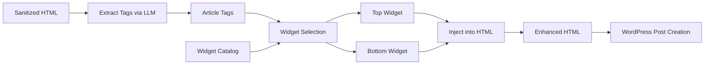
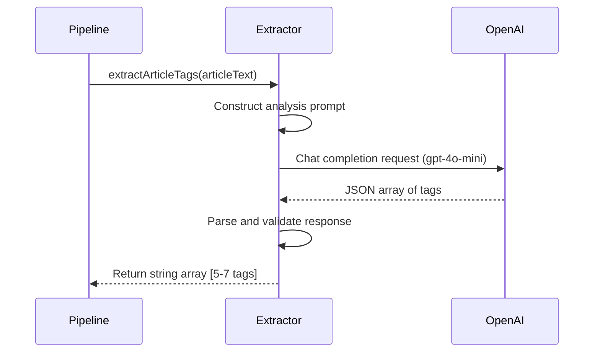
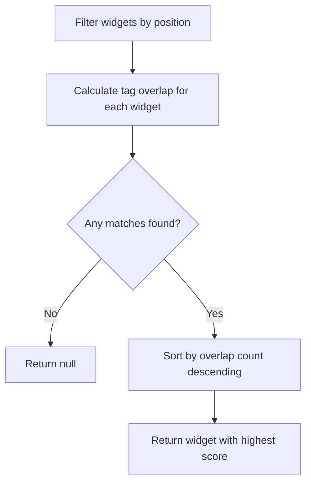
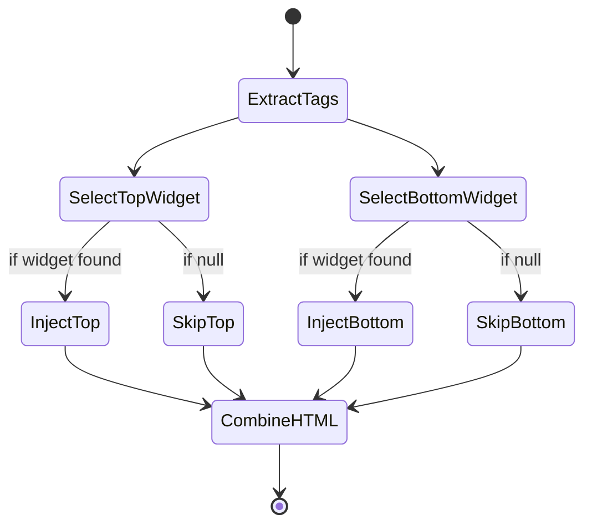

# GetCourse Widgets Integration Design

## Objective

Integrate intelligent GetCourse widget insertion into the content publishing pipeline. The system will analyze article content, extract semantic tags using LLM, and select the most relevant widgets from a predefined catalog based on tag matching. Widgets are injected into the HTML content at strategic positions (top and bottom) before publishing to WordPress.

## Scope

### In Scope
- Configuration structure for GetCourse widget catalog with tag-based metadata
- LLM-powered article tag extraction using OpenAI
- Widget selection algorithm based on tag overlap scoring
- HTML injection logic for top and bottom widget positions
- Integration into existing job-runner pipeline as pre-publishing stage

### Out of Scope
- Dynamic widget fetching from GetCourse API
- Middle-content widget insertion
- A/B testing of widget placements
- Widget performance analytics
- Widget caching strategies

## Business Context

GetCourse widgets serve as lead capture and user engagement mechanisms embedded within published articles. Intelligent placement based on content relevance increases conversion rates by presenting contextually appropriate offers to readers. The system automates what would otherwise require manual editorial decisions for each article.

## Architecture Overview

The widget integration operates as a pipeline stage positioned after HTML sanitization but before WordPress post creation. This ensures clean, safe HTML is enriched with marketing widgets just prior to publication.



## Data Model

### Widget Catalog Structure

The widget catalog defines available GetCourse widgets with their targeting metadata:

| Field | Type | Description | Example |
|-------|------|-------------|---------|
| name | string | Human-readable widget identifier | "face-massage-course" |
| position | 'top' or 'bottom' | Where widget should be placed in content | "top" |
| tags | string array | Semantic keywords for content matching | ["массаж лица", "самомассаж", "косметология"] |
| script | string | Complete HTML script tag ready for embedding | `<script src="..."></script>` |

### Article Tags

Tags extracted from article content via LLM analysis:

| Attribute | Type | Constraint |
|-----------|------|------------|
| Count | number | 5-7 tags per article |
| Language | Russian | Matches GetCourse audience |
| Specificity | Medium | Specific enough to match widgets, broad enough to be reusable |

## Component Design

### Widget Catalog Configuration

**Purpose**: Centralize widget definitions and enable JSON import in TypeScript

**Location**: `src/config/index.ts`

**Responsibilities**:
- Export widget catalog from JSON file using modern import assertions
- Make widgets available to pipeline modules

**Structure Export Pattern**:
The configuration uses TypeScript import assertions to directly import JSON as typed data.

### LLM Tag Extraction Function

**Purpose**: Analyze article text and extract semantic topic tags using OpenAI

**Location**: `src/adapters/llm-openai.ts`

**Function Signature**: `async function extractArticleTags(articleText: string): Promise<string[]>`

**Processing Flow**:



**Prompt Engineering Strategy**:

The system prompt instructs the LLM to:
- Focus on massage and health domain context
- Return 5-7 concise topic tags in Russian
- Use terminology consistent with widget catalog tags
- Format response as pure JSON array of strings

**Error Handling**:
- Validate article text minimum length (prevent meaningless analysis)
- Handle OpenAI API errors with informative exceptions
- Ensure JSON parsing robustness for varied response formats

### Widget Selection Algorithm

**Purpose**: Match article tags to widget catalog and select best candidates

**Location**: `src/pipelines/widgets.ts`

**Function Signature**: `function findBestWidget(articleTags: string[], position: 'top' | 'bottom'): WidgetDefinition | null`

**Selection Logic**:



**Scoring Mechanism**:

For each widget, count how many of its tags appear in the article tags array (case-insensitive comparison). The widget with the maximum overlap count wins selection for that position.

**Edge Cases**:
- Zero matches: Return null (no widget inserted)
- Tie scenario: Return first widget encountered with max score (deterministic behavior)
- Position filtering: Only consider widgets designated for the requested position

### HTML Injection Pipeline

**Purpose**: Insert selected widget scripts into HTML at appropriate positions

**Location**: `src/pipelines/widgets.ts`

**Function Signature**: `async function insertWidgets(html: string, articleText: string): Promise<string>`

**Injection Strategy**:

| Position | Insertion Point | Method |
|----------|----------------|---------|
| Top | After opening body tag or before first content element | Prepend to HTML string |
| Bottom | Before closing body tag or after last content element | Append to HTML string |

**Workflow**:



**Implementation Considerations**:
- Preserve existing HTML structure and formatting
- Ensure widget scripts do not interfere with WordPress rendering
- Handle empty/null widget selections gracefully

## Integration Point

### Job Runner Modification

**Purpose**: Add widget insertion stage to content processing pipeline

**Location**: `src/core/job-runner.ts`

**Insertion Position**: Between HTML sanitization and WordPress post creation

**Before State**:
```
sanitizeHtml() → wordpress.createPost()
```

**After State**:
```
sanitizeHtml() → insertWidgets() → wordpress.createPost()
```

**Logging Strategy**:
- Log start of widget insertion stage with job ID
- Log completion with confirmation message
- Use `finalHtml` variable to distinguish widget-enhanced content from sanitized content

**Error Handling**:
- Widget insertion failures should not block post creation
- Consider fallback to non-enhanced HTML if widget pipeline throws
- Log widget errors but continue job execution

## Non-Functional Considerations

### Performance
- Tag extraction adds one OpenAI API call per job (acceptable latency increase)
- Widget matching is in-memory operation with negligible overhead
- String concatenation for HTML injection is lightweight

### Maintainability
- Widget catalog externalized to JSON for non-developer editability
- Tag extraction prompt can be tuned without code changes
- Selection algorithm is simple and testable

### Security
- Widget scripts must be validated/sanitized before catalog inclusion
- No user input directly influences widget selection (article content is already trusted)
- HTML injection uses basic string operations on pre-sanitized content

### Reliability
- LLM failures should gracefully skip widget insertion rather than fail entire job
- Missing widget catalog should be caught at startup
- Null-safe handling for zero-match scenarios

## Dependencies

### New External Dependencies
None (uses existing OpenAI client and configuration patterns)

### Internal Module Dependencies
- `src/adapters/llm-openai.ts` → OpenAI client instantiation
- `src/pipelines/widgets.ts` → Tag extractor from llm-openai
- `src/pipelines/widgets.ts` → Widget catalog from config
- `src/core/job-runner.ts` → Widget insertion function from pipelines

## Configuration Requirements

### Environment Variables
No new environment variables required (uses existing `OPENAI_API_KEY`)

### Widget Catalog File

**File Location**: `src/config/widgets.json`

**Expected Structure**:
```
Array of objects, each containing:
- name: string
- position: "top" | "bottom"
- tags: string[]
- script: string (complete HTML script tag)
```

**Sample Entry**:
```
{
  "name": "lymphatic-drainage-webinar",
  "position": "top",
  "tags": ["лимфодренаж", "массаж", "отеки"],
  "script": "<script src=\"https://getcourse.ru/widget/12345\"></script>"
}
```

## Testing Considerations

### Unit Testing Scenarios
- Tag extraction with valid article text returns 5-7 tags
- Tag extraction with minimal text throws validation error
- Widget selection with full matches returns highest-scoring widget
- Widget selection with zero matches returns null
- Widget selection correctly filters by position
- HTML injection preserves existing content structure

### Integration Testing Scenarios
- End-to-end job execution with widget catalog produces enhanced HTML
- WordPress post creation receives widget-injected content
- Job completion with no matching widgets still publishes successfully

### Edge Cases
- Empty widget catalog: No widgets inserted
- Article in unexpected language: Tags may not match Russian widget catalog
- Malformed JSON in widget catalog: Fail fast on startup
- OpenAI response format variation: Robust parsing handles different JSON structures

## Rollout Strategy

### Deployment Steps
1. Create widget catalog JSON file with initial GetCourse widget definitions
2. Update configuration exports to include widget catalog
3. Implement tag extraction function in LLM adapter
4. Implement widget selection and injection pipeline
5. Integrate into job runner with logging
6. Test with sample articles covering widget tag spectrum
7. Monitor first production runs for widget insertion success rate

### Rollback Plan
If widget insertion causes issues:
- Remove widget pipeline call from job-runner
- System reverts to publishing non-enhanced HTML
- No data loss or corruption risk

### Monitoring
- Log widget insertion success/failure per job
- Track widget selection outcomes (top found, bottom found, none found)
- Monitor post-publication WordPress rendering for script errors
