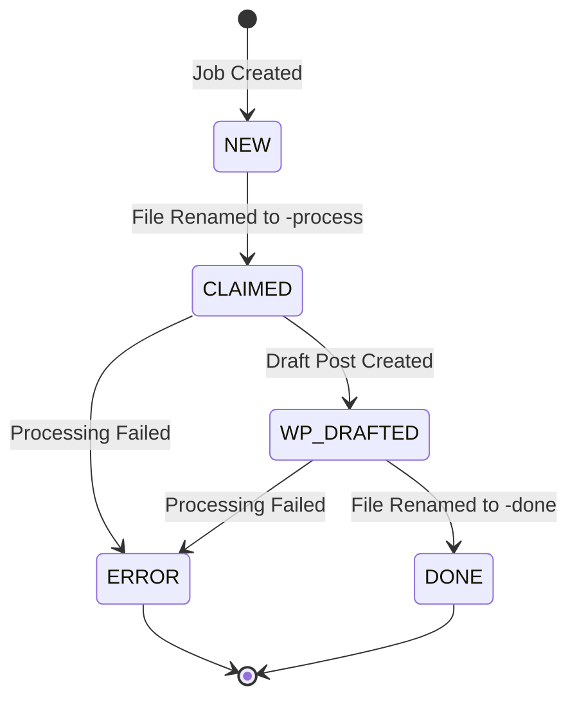
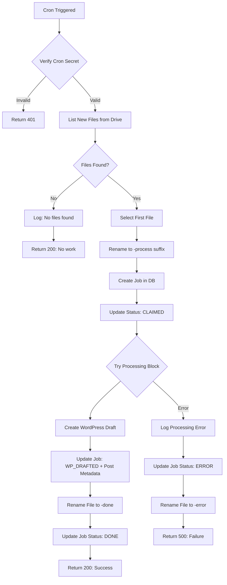

# End-to-End File Processing Workflow Implementation

## Overview

This design document outlines the implementation of a minimal end-to-end workflow that orchestrates file processing from Google Drive through job tracking to WordPress publishing. The system will process one file per cron execution, managing its lifecycle through database state transitions and external service interactions.

## Objectives

- Establish authenticated connections to Google Drive and WordPress APIs
- Implement job creation and state management in the database
- Create a complete workflow that processes a single file from discovery to completion
- Ensure reliable error handling and state tracking throughout the process

## System Components

### 1. Authentication Layer

#### Google Drive Authentication

**Purpose**: Establish authenticated access to Google Drive API using service account credentials

**Configuration Requirements**:
- Environment variable `GOOGLE_SERVICE_ACCOUNT_JSON` containing service account credentials
- Service account must have access to the target Google Drive folder

**Authentication Flow**:
- Parse service account JSON from environment variable
- Create Google Auth client with appropriate scopes (drive.files, drive.metadata)
- Initialize Drive API client instance with authenticated credentials

#### WordPress Authentication

**Purpose**: Configure HTTP client for WordPress REST API access with Basic Authentication

**Configuration Requirements**:
- Environment variable `WP_USERNAME` containing WordPress username
- Environment variable `WP_APP_PASSWORD` containing application-specific password
- Environment variable `WP_SITE_URL` containing WordPress site base URL

**Authentication Strategy**:
- Create HTTP client instance with pre-configured Authorization header
- Encode credentials in Base64 format for Basic Auth
- Set default headers and base URL for all WordPress API requests

### 2. State Management Functions

#### Job Creation

**Function**: createJob

**Purpose**: Initialize a new job record in the database to track file processing

**Input Parameters**:

| Parameter | Type | Description |
|-----------|------|-------------|
| fileId | string | Google Drive file identifier |
| revisionId | string | File version/revision identifier |

**Behavior**:
- Create new database record in Job table
- Set initial status to NEW
- Store file identifiers for traceability
- Return created job object with generated ID

**Database Operation**: Insert into Job table with default NEW status

#### Job Status Update

**Function**: updateJobStatus

**Purpose**: Transition job through processing states and store associated metadata

**Input Parameters**:

| Parameter | Type | Description |
|-----------|------|-------------|
| jobId | string | Unique job identifier |
| status | string | Target status (CLAIMED, WP_DRAFTED, DONE, ERROR) |
| metadata | object | Optional additional data (postId, postEditLink, errorMessage) |

**Behavior**:
- Locate job record by ID
- Update status field to new value
- Merge metadata into job record if provided
- Update timestamp for audit trail

**Status Transitions**:

### 3. Google Drive Adapter Functions

#### List New Files

**Function**: listNewFiles

**Purpose**: Discover unprocessed files in designated Google Drive folder

**Configuration Input**:
- Environment variable `GOOGLE_DRIVE_FOLDER_ID` specifying target folder

**Query Logic**:
- Search for files within specified folder
- Filter files based on naming pattern: exclude files with suffixes `-process`, `-done`, or `-error`
- Return list of file objects containing ID, name, and version metadata

**Return Structure**:

| Field | Type | Description |
|-------|------|-------------|
| id | string | File identifier |
| name | string | Current filename |
| version | string | Revision/version identifier |

#### Rename File

**Function**: renameFile

**Purpose**: Update file name in Google Drive to reflect processing state

**Input Parameters**:

| Parameter | Type | Description |
|-----------|------|-------------|
| fileId | string | Target file identifier |
| newName | string | Desired filename |

**Behavior**:
- Locate file by ID in Google Drive
- Update file name metadata
- Preserve all other file properties

**State Marking Convention**:
- Suffix `-process`: File currently being processed
- Suffix `-done`: File successfully processed
- Suffix `-error`: File processing failed

### 4. WordPress Adapter Function

#### Create Post

**Function**: createPost

**Purpose**: Create draft post in WordPress via REST API

**Input Parameters**:

| Parameter | Type | Required | Description |
|-----------|------|----------|-------------|
| title | string | Yes | Post title |
| content | string | Yes | Post HTML content |
| status | string | Yes | Publication status (draft, publish) |

**API Integration**:
- Endpoint: POST `/wp-json/wp/v2/posts`
- Authentication: Basic Auth via pre-configured HTTP client
- Content-Type: application/json

**Response Structure**:

| Field | Type | Description |
|-------|------|-------------|
| id | number | WordPress post ID |
| edit_link | string | Admin edit URL |

### 5. Orchestration Logic

#### Cron Handler Workflow

**Endpoint**: api/cron/poll-drive.ts

**Execution Frequency**: Scheduled via Vercel cron configuration

**Authentication Check**:
- Verify CRON_SECRET from request Authorization header if configured
- Reject unauthorized requests with 401 status

**Processing Flow**:

**Detailed Step Sequence**:

1. **Discovery Phase**
   - Query Google Drive for new files
   - If no files found: log and exit successfully
   - Select first file from results (single-file processing)

2. **Claim Phase**
   - Rename file with `-process` suffix to indicate processing started
   - Create job record in database with file metadata
   - Update job status to CLAIMED
   - Log job creation with file details

3. **Processing Phase** (within try-catch block)
   - Construct post title: `[AUTO] {original filename}`
   - Construct post content: Includes original filename, file ID, and job ID
   - Create draft post in WordPress with constructed content
   - Log successful post creation with WordPress post ID
   - Update job record with status WP_DRAFTED and post metadata (postId, postEditLink)

4. **Completion Phase**
   - Rename file with `-done` suffix to indicate successful processing
   - Update job status to DONE
   - Log job completion
   - Return success response with job ID and processed filename

5. **Error Handling Phase** (on any processing error)
   - Log error details
   - Update job status to ERROR with error message in metadata
   - Rename file with `-error` suffix to prevent reprocessing
   - Re-throw error to outer catch block
   - Return 500 status with error details

## Data Flow

### File Naming State Transitions

| Original State | After Claim | After Success | After Error |
|----------------|-------------|---------------|-------------|
| document.txt | document.txt-process | document.txt-done | document.txt-error |

### Job Metadata Evolution

**At Creation**:
- fileId: Google Drive file ID
- revisionId: File version
- status: NEW

**After Claim**:
- status: CLAIMED

**After WordPress Draft**:
- status: WP_DRAFTED
- postId: WordPress post ID
- postEditLink: WordPress admin edit URL

**On Success**:
- status: DONE

**On Error**:
- status: ERROR
- errorMessage: Exception message text

## API Response Formats

### Success Response (No Files)

| Field | Value |
|-------|-------|
| success | true |
| message | "No new files found." |

### Success Response (File Processed)

| Field | Value |
|-------|-------|
| success | true |
| message | "Processed file: {filename}" |
| jobId | Database job ID |

### Error Response

| Field | Value |
|-------|-------|
| success | false |
| message | "Cron job failed" |
| error | Error message string |

## Environment Variables Required

| Variable | Purpose | Example |
|----------|---------|---------|
| GOOGLE_SERVICE_ACCOUNT_JSON | Service account credentials | JSON string |
| GOOGLE_DRIVE_FOLDER_ID | Target folder identifier | 1a2b3c4d5e6f |
| WP_SITE_URL | WordPress site base URL | https://example.com |
| WP_USERNAME | WordPress username | admin |
| WP_APP_PASSWORD | WordPress app password | xxxx xxxx xxxx xxxx |
| CRON_SECRET | Cron authentication token | Optional |

## Error Handling Strategy

### Principle
Each layer handles errors specific to its domain and propagates critical failures upward with context

### Layer-Specific Handling

**Adapter Layer**:
- Catch API-specific errors (network, authentication, rate limits)
- Transform into application-specific error types
- Include original error details for debugging

**State Management Layer**:
- Catch database connection and query errors
- Ensure transaction consistency
- Log database operation failures

**Orchestration Layer**:
- Catch all processing errors
- Update job status to ERROR state
- Mark files to prevent reprocessing
- Log comprehensive error context
- Return appropriate HTTP status codes

### Retry Strategy
Current implementation processes one file per execution without retries. Failed files remain marked with `-error` suffix and require manual intervention.

## Logging Strategy

**Key Events to Log**:
- Cron job start
- File discovery count
- File selection for processing
- Job creation with IDs
- WordPress post creation success
- Job completion
- All errors with full stack traces

**Log Format**: Structured logging via centralized logger with timestamp and severity level

## Testing Verification Steps

After implementation, verify the workflow by:

1. Configure environment variables in `.env` file
2. Run database migrations to create Job table
3. Place test file in configured Google Drive folder
4. Trigger cron endpoint manually or wait for scheduled execution
5. Verify outcomes:
   - Job record exists in database with DONE status
   - WordPress draft post created with expected content
   - File renamed with `-done` suffix in Google Drive
   - Logs show complete execution flow

## Implementation Constraints

- Process exactly one file per cron execution (prevents overwhelming system)
- Use draft status for all WordPress posts (requires manual review before publishing)
- File naming convention must be strictly followed for state tracking
- No automatic retry mechanism (manual intervention required for errors)
- Synchronous processing model (no concurrent job execution)
