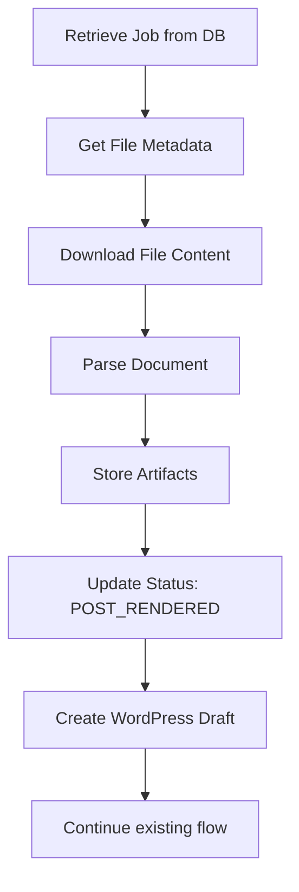
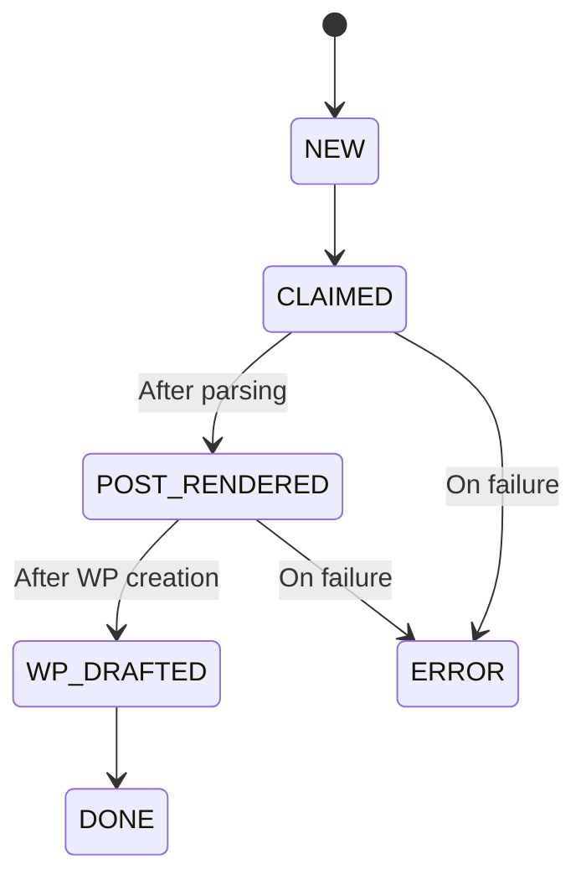

# Pipeline Content Download - Design Document

## Overview

This design defines the implementation of the first pipeline stage: downloading and parsing document content from Google Drive. The system must handle both Google Docs (exported via Drive API) and binary formats like .docx (downloaded as media), converting them into structured text and HTML representations.

## Objectives

1. Download document content from Google Drive supporting multiple formats
2. Parse downloaded content into structured text and HTML
3. Integrate parsing into the job execution workflow
4. Store parsed artifacts in the database for downstream pipeline stages

## System Components

### Component Responsibilities

| Component | Responsibility | Input | Output |
|-----------|---------------|-------|--------|
| drive.ts adapter | Download file content from Google Drive | File ID, MIME type | File content buffer |
| parse-input.ts pipeline | Parse document buffer into text/HTML | File buffer, MIME type | Parsed document structure |
| job-runner.ts orchestrator | Coordinate download and parsing | Job ID | Updated job status with artifacts |

## File Content Retrieval Strategy

### Drive Adapter Enhancement

The `getFileContent` function in `src/adapters/drive.ts` must handle two distinct download strategies:

#### Google Document Export

For native Google Workspace documents (Google Docs, Sheets, Slides):
- Use `drive.files.export` API endpoint
- Specify target export MIME type (text/plain or text/html)
- Receive content directly as response stream
- Convert stream to Buffer for pipeline processing

#### Binary File Download

For uploaded files (.docx, .pdf, images):
- Use `drive.files.get` API endpoint with `alt: 'media'` parameter
- Retrieve raw binary content
- Handle as response stream and convert to Buffer

### File Type Detection

The function requires MIME type parameter to determine download strategy:

| MIME Type Pattern | Download Method | Target Format |
|-------------------|----------------|---------------|
| application/vnd.google-apps.document | export | text/html |
| application/vnd.openxmlformats-officedocument.wordprocessingml.document | get (media) | binary |
| Other Google apps MIME types | export | appropriate format |
| Other binary MIME types | get (media) | binary |

### Error Handling Requirements

The download operation must handle:
- Network failures during content retrieval
- Invalid or inaccessible file IDs
- Permission denied errors
- Export format not supported for file type
- Response stream processing failures

## Document Parsing Strategy

### Parser Implementation

The `parseDocument` function in `src/pipelines/parse-input.ts` must support multiple document formats:

#### DOCX Processing

For Microsoft Word documents:
- Use mammoth library for extraction
- Extract both raw text and HTML representation
- Preserve document structure in HTML output
- Handle embedded images (metadata extraction for future stages)

Mammoth provides two extraction modes:
- `extractRawText`: Pure text without formatting
- `convertToHtml`: Structured HTML preserving formatting

The function should utilize `convertToHtml` for HTML output and derive text from HTML to maintain consistency.

#### Plain Text Processing

For exported Google Docs (text/plain):
- Convert Buffer to UTF-8 string
- Use as-is for text representation
- Generate minimal HTML wrapper for consistency

#### HTML Processing

For exported Google Docs (text/html):
- Parse HTML structure
- Extract text content by stripping tags
- Preserve HTML for downstream formatting pipeline

### Parsed Document Structure

Return type definition:

| Field | Type | Purpose | Source |
|-------|------|---------|--------|
| text | string | Plain text content | Extracted from document |
| rawHtml | string | HTML representation | Mammoth conversion or exported HTML |
| metadata (optional) | object | Document properties | Future enhancement |

### MIME Type Handling Matrix

| MIME Type | Processing Strategy | Text Extraction | HTML Generation |
|-----------|-------------------|-----------------|-----------------|
| application/vnd.openxmlformats-officedocument.wordprocessingml.document | mammoth.convertToHtml | Strip HTML tags | Direct output |
| text/plain | Buffer to string | Direct use | Wrap in basic HTML |
| text/html | Parse HTML | Strip tags | Direct use |

## Job Runner Integration

### Pipeline Execution Flow

The job runner must be enhanced to incorporate content download and parsing between job retrieval and WordPress post creation:

### Implementation Steps

#### Step 1: File Metadata Retrieval

Before downloading content, retrieve file metadata to determine MIME type:
- Call `drive.files.get` with fields parameter requesting mimeType
- Extract MIME type from response
- Pass to content download function

#### Step 2: Content Download

Invoke enhanced `getFileContent` function:
- Pass file ID and MIME type
- Receive Buffer containing file content
- Handle download errors by updating job status to ERROR

#### Step 3: Document Parsing

Invoke `parseDocument` function:
- Pass downloaded Buffer and MIME type
- Receive parsed document structure
- Handle parsing errors appropriately

#### Step 4: Artifact Storage

Store parsed content in database:
- Create Artifact record with kind: "RAW_TEXT"
- Store text content in JSON field
- Create Artifact record with kind: "HTML"
- Store HTML content in JSON field
- Link artifacts to current job via jobId foreign key

#### Step 5: Status Update

Update job status to reflect completion of parsing stage:
- Set status to "POST_RENDERED"
- Indicates content is ready for formatting pipeline
- Maintains compatibility with existing status workflow

### WordPress Post Content Update

Replace placeholder post content with parsed text:
- Use parsed text field for initial post content
- Defer HTML formatting to subsequent pipeline stages
- Maintain draft status for manual review

### Error Handling Integration

Extend existing error handling:
- Catch errors from getFileContent
- Catch errors from parseDocument
- Update job status to ERROR with descriptive message
- Rename file with -error suffix
- Log full error details for debugging

## Database Schema Utilization

### Artifact Storage

Leverage existing Artifact model:

| Field | Value | Purpose |
|-------|-------|---------|
| jobId | Current job ID | Link to parent job |
| kind | "RAW_TEXT" | Identifies artifact type |
| content | { text: string } | Stores extracted text |

| Field | Value | Purpose |
|-------|-------|---------|
| jobId | Current job ID | Link to parent job |
| kind | "HTML" | Identifies artifact type |
| content | { html: string } | Stores HTML representation |

### Status Transition

Job status flow update:

## Dependencies

### External Libraries

| Library | Purpose | Already Installed |
|---------|---------|-------------------|
| googleapis | Google Drive API client | Yes |
| mammoth | DOCX to HTML/text conversion | Yes |
| @prisma/client | Database operations | Yes |

### Internal Modules

| Module | Import From | Usage |
|--------|-------------|-------|
| drive adapter | ../adapters/drive.js | File download |
| parse-input pipeline | ../pipelines/parse-input.js | Document parsing |
| state module | ./state.js | Artifact creation |
| logger | ./logger.js | Operation logging |

## Logging Strategy

### Log Points

Key operations requiring logging:

1. File metadata retrieval start and completion
2. Content download start with file ID and MIME type
3. Download completion with buffer size
4. Parse operation start with MIME type
5. Parse completion with content statistics (word count, HTML size)
6. Artifact creation for each stored artifact
7. Status update to POST_RENDERED
8. All error conditions with context

### Log Levels

| Operation | Success Level | Failure Level |
|-----------|--------------|---------------|
| Metadata retrieval | info | error |
| Content download | info | error |
| Document parsing | info | error |
| Artifact storage | info | error |
| Status update | info | error |

## Future Enhancements

### Advanced Metadata Extraction

Extend ParsedDocument interface to include:
- Document title from internal metadata
- Author information
- Word count statistics
- Creation and modification dates
- Embedded image inventory

### Format Support Expansion

Additional document formats to support:
- PDF files (using pdf-parse library)
- Rich text format (RTF)
- Plain markdown files
- Google Sheets exported as CSV/Excel

### Content Validation

Implement validation rules:
- Minimum word count requirements
- Maximum document size limits
- Prohibited content detection
- Language detection and validation

### Performance Optimization

Future optimization opportunities:
- Streaming processing for large files
- Parallel metadata and content retrieval
- Cached export format preferences
- Incremental parsing for partial updates
