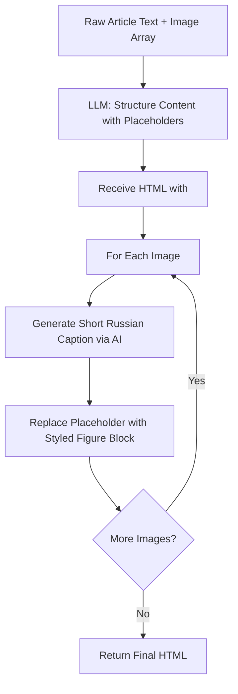
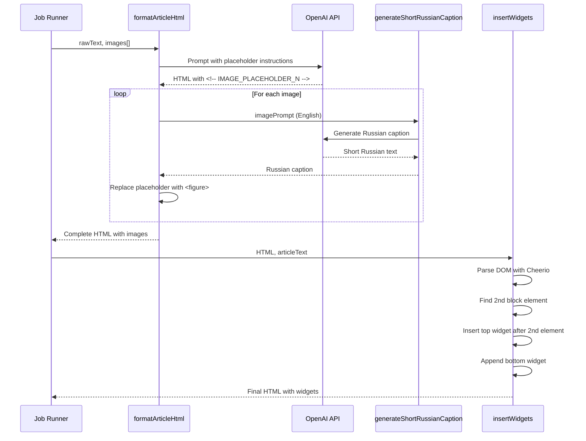

# Pipeline Refactoring: Image Placeholders and Widget Positioning

## Problem Statement

The current content pipeline exhibits three critical issues that compromise content quality and predictability:

1. **Insufficient Image Integration**: Only a single image is inserted into articles, despite multiple images being available
2. **Improper Image Sizing**: Images are rendered at excessive dimensions without appropriate constraints
3. **Unpredictable Widget Placement**: Widgets are inserted at inconsistent positions within the content structure

These issues stem from the current approach where the LLM directly generates complete HTML including image tags, resulting in loss of control over visual presentation and layout precision.

## Strategic Solution

Transform the content formatting pipeline from direct HTML generation to a placeholder-based architecture that separates content structure definition from visual asset rendering. This approach establishes clear separation of concerns:

- **LLM Responsibility**: Determine logical positions for visual elements within content flow
- **Application Responsibility**: Control exact HTML rendering, styling, and asset presentation

## Design Overview

### Architecture Shift

| Current Approach | New Approach |
|------------------|--------------|
| LLM generates complete `<figure>` tags with inline styles | LLM inserts semantic placeholders (`<!-- IMAGE_PLACEHOLDER_N -->`) |
| No guarantee all images are used | LLM explicitly instructed to use all available images |
| Styling inconsistent, embedded in prompt | Consistent styling applied programmatically |
| Russian captions manually embedded in complex prompt | Dedicated AI function generates concise Russian captions |
| Widget insertion based on paragraph counting | Widget insertion based on block-level DOM traversal |

### Component Modifications

Three components require strategic modification:

1. **Content Formatter** (`src/pipelines/format-content.ts`)
2. **LLM Adapter** (`src/adapters/llm-openai.ts`)
3. **Widget Inserter** (`src/pipelines/widgets.ts`)

---

## Content Formatter Refactoring

### Objective

Restructure the article formatting process to use image placeholders, enabling deterministic replacement with properly styled HTML.

### Modified Behavior Flow



### Prompt Redesign

The AI prompt strategy must be fundamentally restructured to prioritize placeholder insertion over direct HTML generation.

#### New System Prompt

The system prompt establishes the LLM's role as a structural editor rather than a visual designer:

**Core Instructions:**
- Use standard semantic HTML elements (`<p>`, `<h2>`, `<h3>`, `<ul>`, `<ol>`)
- Insert image placeholders at contextually appropriate positions
- Placeholder format: `<!-- IMAGE_PLACEHOLDER_1 -->`, `<!-- IMAGE_PLACEHOLDER_2 -->`, etc.
- **Critical constraint**: All available image placeholders must be inserted
- **Strict prohibition**: Do not generate `` or `<figure>` tags directly
- Output body content only, without wrapper elements

#### New User Prompt

The user prompt must explicitly communicate image availability and enforce complete placeholder usage:

**Content:**
- Specify exact number of available images
- Provide range of placeholder identifiers to insert
- Include raw article text for formatting

**Example Structure:**
```
Format the following text. You have 3 images available. 
Please insert the placeholders <!-- IMAGE_PLACEHOLDER_1 --> 
through <!-- IMAGE_PLACEHOLDER_3 --> into the text at logical points.

Raw text:
[article content]
```

### Post-Processing: Placeholder Replacement

After receiving structured HTML from the LLM, the application assumes full control over visual rendering.

#### Replacement Logic

For each image in the array:

1. Generate localized Russian caption (via dedicated AI function)
2. Construct semantically correct `<figure>` block
3. Apply consistent styling constraints
4. Replace corresponding placeholder with complete HTML

#### Figure Block Structure

Each image must be rendered using this exact HTML pattern:

**Semantic Container:**
- Outer element: `<figure>` with WordPress-compatible classes
- Classes: `wp-block-image aligncenter size-large`
- Inline style: `max-width: 600px; margin: 20px auto;`

**Image Element:**
- Source: Image URL from upload result
- Alt text: Original English generation prompt (for accessibility)

**Caption Element:**
- Content: Short Russian description (generated via AI)
- Styling: `text-align: center; font-style: italic;`

### Russian Caption Generation

The existing prompt strategy for Russian captions is overly complex and embedded within the main formatting prompt. This creates unreliable output quality.

**Solution:** Extract caption generation into a dedicated, focused AI function with single responsibility.

---

## LLM Adapter Enhancement

### New Function: `generateShortRussianCaption`

#### Purpose

Generate concise, contextually appropriate Russian captions from English image generation prompts.

#### Specification

| Parameter | Type | Description |
|-----------|------|-------------|
| `imagePrompt` | string | Original English prompt used for image generation |
| **Returns** | Promise<string> | Short Russian caption (7-10 words maximum) |

#### Prompt Strategy

**System Context:**
- Role: Helpful assistant
- Task: Transform English image prompt into short Russian descriptive caption
- Constraint: Maximum 7-10 words
- Language: Russian output required

**User Input:**
- Directly provide the English image prompt

#### Error Handling

| Scenario | Response |
|----------|----------|
| API request fails | Log error, return fallback text |
| Empty response | Return fallback text |
| Fallback text | "Иллюстрация к статье" |

#### Model Configuration

- **Model**: `gpt-4o-mini` (cost-effective for simple transformation)
- **Temperature**: 0.5 (balanced creativity and consistency)

---

## Widget Insertion Refactoring

### Problem Analysis

The current widget insertion logic counts `<p>` tags to determine placement position. This approach is fragile because:

- Article structure may include headings, lists, blockquotes, and figures
- Counting only paragraphs creates inconsistent visual positioning
- Top widget may appear too deep in the content when headings are present

### Strategic Solution

Replace paragraph-counting with block-level DOM traversal using Cheerio, enabling semantic awareness of all content elements.

### Revised Insertion Logic

#### Top Widget Placement

**Strategy:** Insert after the second block-level element to ensure above-the-fold visibility.

**Block Element Definition:**
Elements considered as content blocks for counting purposes:
- Paragraphs: `<p>`
- Headings: `<h2>`, `<h3>`
- Lists: `<ul>`, `<ol>`
- Quotes: `<blockquote>`
- Images: `<figure>`

**Placement Rules:**

| Condition | Action |
|-----------|--------|
| Content has 3+ block elements | Insert after 2nd block element |
| Content has <3 block elements | Insert at document beginning |

**Rationale for "After 2nd Element":**
- Ensures widget appears early without disrupting opening paragraph
- Accounts for heading elements that don't contribute to "3rd paragraph" count
- More predictable visual positioning

#### Bottom Widget Placement

**Strategy:** Append to document end (no change from current implementation).

**Placement:**
- Always insert as final content element
- Serves as universal call-to-action or engagement widget

### DOM Manipulation Approach

Use Cheerio's jQuery-like API for precise DOM manipulation:

1. Load HTML into Cheerio with appropriate parser settings
2. Select all block-level elements via compound selector
3. Use `.eq()` to target specific element by index
4. Use `.after()` to insert widget HTML adjacently
5. Extract modified HTML via `.html()`

### Widget Property Reference

The configuration expects widgets to have an `embed_html` or `script` property containing the raw HTML/JavaScript to insert. The refactored logic should access the correct property based on widget definition structure.

**Expected Property Name:** Confirm whether widgets use `embed_html` or `script` property, then use consistently.

---

## Implementation Checklist

### Phase 1: LLM Adapter Enhancement
- Add `generateShortRussianCaption` function to `src/adapters/llm-openai.ts`
- Export function for use in format-content pipeline
- Test function independently with sample prompts
- Validate error handling and fallback behavior

### Phase 2: Content Formatter Refactoring
- Replace system prompt with placeholder-focused instructions
- Replace user prompt to explicitly declare available placeholders
- Remove existing image rendering logic from prompt
- Implement placeholder replacement loop after LLM response
- Integrate caption generation for each image
- Construct figure blocks with consistent styling
- Test with various article lengths and image counts

### Phase 3: Widget Insertion Refactoring
- Import Cheerio (verify already imported)
- Replace paragraph selector with compound block element selector
- Change insertion logic from "after 3rd paragraph" to "after 2nd block element"
- Verify property name (`embed_html` vs `script`) in widget configuration
- Test with articles containing various heading structures

### Phase 4: Integration Testing
- Test complete pipeline with 1, 2, 3, and 4 images
- Verify all images appear in final output
- Validate image sizing constraints (max-width: 600px)
- Verify Russian captions are concise and relevant
- Test widget positioning with different article structures
- Check for edge cases (very short articles, no headings, etc.)

---

## Data Flow Diagram



---

## Risk Assessment

| Risk | Impact | Mitigation |
|------|--------|-----------|
| LLM fails to insert all placeholders | Some images not displayed | Validate placeholder count matches image count; log warning |
| Caption generation fails for one image | Generic caption used | Implement robust fallback mechanism |
| Article has fewer than 2 block elements | Top widget placement unclear | Fallback to prepend behavior |
| Widget property name mismatch | Widgets not inserted | Verify widget schema before implementation |

---

## Expected Outcomes

### Content Quality Improvements

1. **Complete Image Integration**: All uploaded images appear in article layout
2. **Consistent Image Presentation**: Uniform sizing (600px max-width), spacing, and styling
3. **Localized Captions**: Concise, relevant Russian descriptions for reader context
4. **Predictable Widget Positioning**: Top widget consistently appears above-the-fold, accounting for all content types

### Architectural Benefits

1. **Separation of Concerns**: LLM determines placement logic; application controls rendering
2. **Maintainability**: Visual styling changes require no prompt modification
3. **Reliability**: Deterministic HTML generation reduces variability
4. **Extensibility**: Placeholder pattern can extend to other content types (videos, embeds, etc.)
