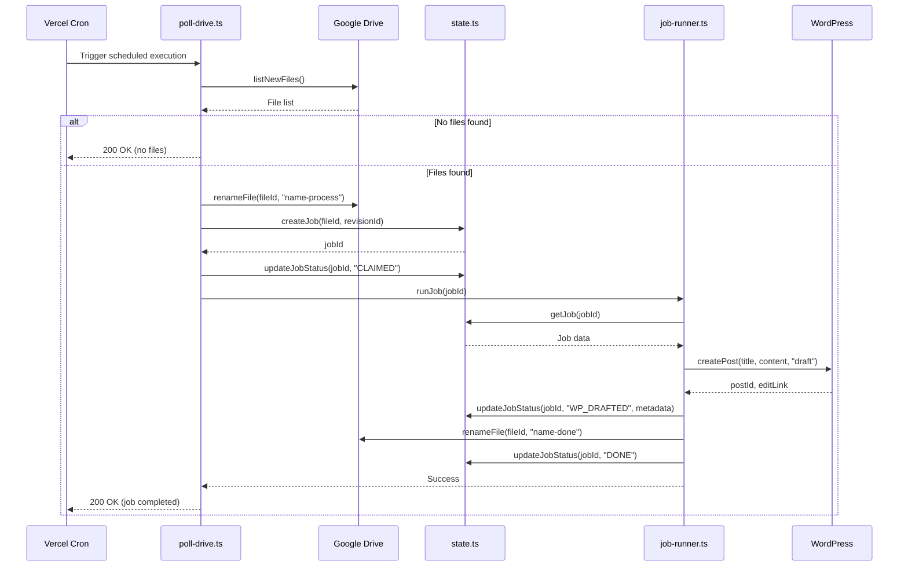
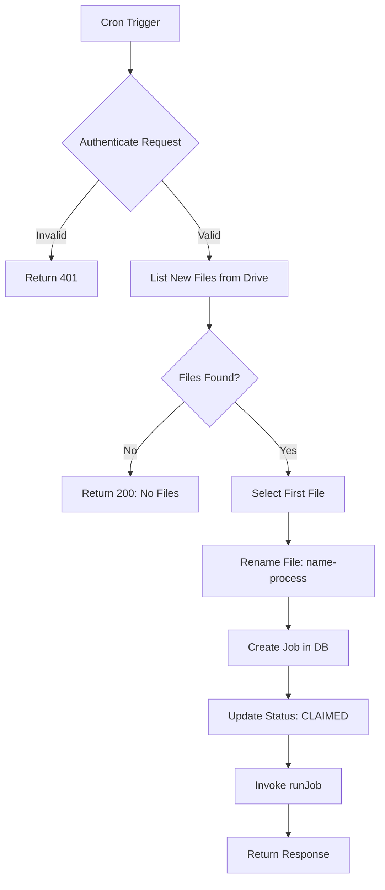
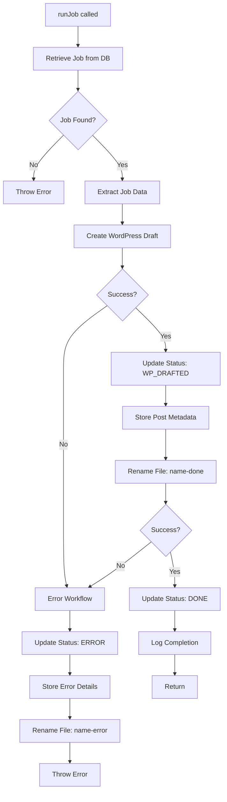

# Refactoring: Separation of Concerns for Job Processing

## Objective

Restructure the job processing architecture to enforce clear separation of concerns between job discovery and job orchestration. The cron endpoint should focus solely on discovering new files and initiating jobs, while the job runner should contain all pipeline execution logic.

## Current State

Currently, the file `src/api/cron/poll-drive.ts` contains both job discovery logic and complete pipeline execution logic including WordPress post creation, status updates, and file renaming. This creates a monolithic design that is difficult to test, extend, and maintain.

**Problems with Current Architecture:**
- Business logic is scattered across the cron endpoint
- Difficult to reuse job processing logic in other contexts
- Testing requires triggering the entire cron endpoint
- Pipeline stages are tightly coupled to the discovery mechanism
- Cannot easily run jobs independently from the polling mechanism

## Target Architecture

### High-Level Separation

The system will be split into two distinct components with clear responsibilities:

| Component | Responsibility | Input | Output |
|-----------|---------------|-------|--------|
| poll-drive.ts | File discovery and job initialization | Cron trigger | Job ID in database |
| job-runner.ts | Job execution through pipeline stages | Job ID | Completed job with status |

### Workflow Sequence

## Component Design

### poll-drive.ts - Job Discovery Service

**Sole Responsibility:** Discover new files and delegate processing

**Operations:**
1. Authenticate cron request using CRON_SECRET
2. Query Google Drive for new files
3. Claim first available file by renaming to "-process" suffix
4. Create job record in database
5. Update job status to CLAIMED
6. Invoke job runner
7. Return HTTP response

**Success Criteria:**
- File is atomically claimed before job creation
- Job record exists in database with CLAIMED status
- Job runner is invoked with valid job ID

**Error Handling Strategy:**
- Authentication failure: Return 401 immediately
- No files found: Return 200 with informational message
- Processing failure: Log error, return 500

**State Transitions Managed:**
- NEW → CLAIMED

### job-runner.ts - Pipeline Orchestrator

**Sole Responsibility:** Execute job through all pipeline stages

**Operations:**
1. Retrieve job data from database
2. Execute pipeline stages in sequence
3. Update job status at each stage completion
4. Handle errors with rollback logic
5. Finalize file state in Google Drive

**Pipeline Stages:**

| Stage | Input | Operation | Output | Status Update |
|-------|-------|-----------|--------|---------------|
| Initialization | Job ID | Load job data from database | Job object | - |
| WordPress Draft | Job data | Create draft post with placeholder content | Post ID, Edit Link | WP_DRAFTED |
| Completion | Post metadata | Rename file to "-done" suffix | - | DONE |

**Error Handling Strategy:**
- Any stage failure triggers error workflow
- Job status updated to ERROR with error details
- File renamed to "-error" suffix to prevent reprocessing
- Original error is re-thrown after cleanup

**State Transitions Managed:**
- CLAIMED → WP_DRAFTED
- WP_DRAFTED → DONE
- Any state → ERROR

### state.ts - State Management Enhancement

**New Requirement:** Implement getJob function

**Function Signature:**
- Input: jobId (string)
- Output: Job object with all fields from database
- Error: Throw if job not found

**Retrieved Fields:**
- id, fileId, revisionId
- status, errorCode, errorMessage
- startedAt, finishedAt
- postId, postEditLink

## Data Flow

### Job Creation Flow

### Job Execution Flow

## Implementation Requirements

### poll-drive.ts Modifications

**Remove:**
- WordPress post creation logic
- Status update to WP_DRAFTED
- File renaming to "-done" suffix
- Final status update to DONE
- Try-catch for processing errors (moved to job-runner)

**Keep:**
- Authentication check
- File discovery via listNewFiles
- File claiming via rename to "-process"
- Job creation and CLAIMED status update
- Top-level try-catch for discovery errors

**Add:**
- Import runJob from job-runner
- Synchronous await call to runJob

### job-runner.ts Implementation

**Required Imports:**
- drive adapter for file operations
- wordpress adapter for post operations
- state manager for job retrieval and updates
- logger for detailed execution tracking

**Function Structure:**
- Outer try-catch block for error handling
- Sequential await calls for each stage
- Logging before and after each operation
- Metadata collection for status updates

**Logging Requirements:**
- Log job start with job ID
- Log each stage start and completion
- Log all external API calls
- Log final status (DONE or ERROR)

### state.ts Enhancement

**Implement getJob Function:**
- Use Prisma client to query Job table
- Query by job ID using where clause
- Return complete job record
- Throw descriptive error if job not found

## Validation Criteria

### Functional Validation

The refactored system must satisfy these conditions:
1. New files discovered by poll-drive are successfully processed
2. Job records accurately track status progression
3. WordPress draft posts are created with correct content
4. Files are renamed with appropriate suffixes based on outcome
5. Errors during processing result in ERROR status and -error suffix

### Architectural Validation

The refactored system must demonstrate:
1. poll-drive.ts contains no WordPress or pipeline logic
2. job-runner.ts can execute jobs independently given a job ID
3. All pipeline logic resides in job-runner.ts
4. Clear separation enables independent testing of components
5. State transitions are properly managed by respective components

## Future Extensibility

This refactoring establishes foundation for:
- Adding additional pipeline stages to job-runner
- Implementing asynchronous job execution via queue
- Supporting parallel job processing
- Retry mechanisms for failed stages
- Manual job triggering via alternative endpoints
- Testing job pipeline independently from polling mechanism

## Non-Functional Considerations

### Execution Model
- Currently synchronous: poll-drive waits for runJob completion
- Future: Job runner can be decoupled via message queue
- Enables horizontal scaling of job processing

### Transaction Safety
- File renaming acts as distributed lock
- Job creation and status updates are atomic database operations
- Error states prevent infinite reprocessing loops

### Observability
- Comprehensive logging at each stage boundary
- Job status in database provides execution history
- Error messages captured for debugging
