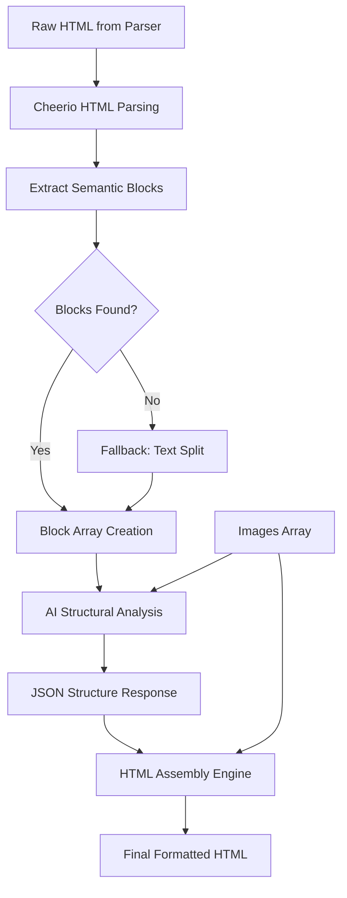
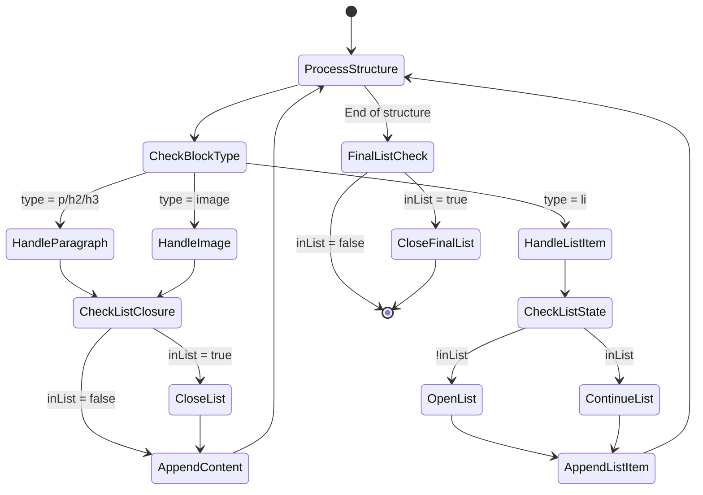
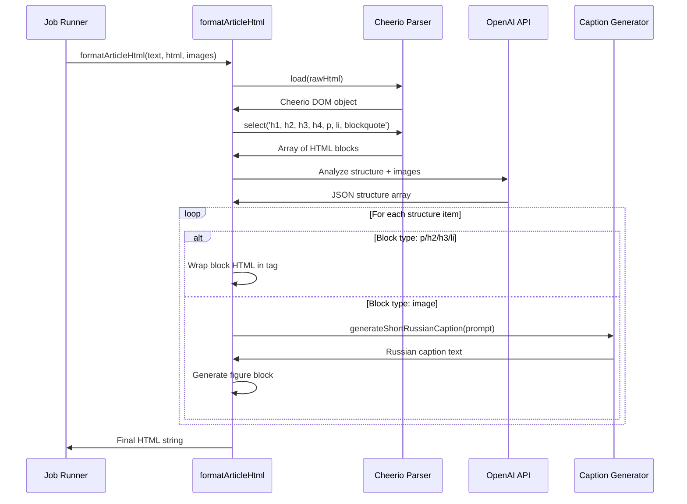

# Structural HTML Pipeline Fix: HTML-Block-Based Approach

## Problem Statement

The current structural pipeline implementation in `formatArticleHtml` relies on splitting raw text by double newlines (`\n\n`) to identify paragraphs. This approach fails when processing Google Docs exports because:

- Google Docs HTML export does not guarantee consistent paragraph separation with `\n\n` in the text content
- The entire document content may appear as a single continuous text block when extracted via `textContent`
- This causes all content to be treated as one paragraph, breaking downstream block indexing and structural analysis

**Critical Failure Mode**: When text splitting produces only one block, the AI structural analyzer returns indices that reference non-existent blocks, resulting in content loss or misalignment.

## Objective

Refactor the `formatArticleHtml` function to use pre-parsed HTML blocks from the source document as the foundation for structural analysis, instead of relying on text-based paragraph splitting. This ensures structure preservation regardless of text formatting inconsistencies.

## Solution Design

### Core Principle

**Source of Truth Shift**: Move from text-based splitting to HTML-based block extraction using the existing `parsedDoc.rawHtml` output.

### Architecture Overview



### Processing Stages

#### Stage 1: HTML Block Pre-Parsing

**Purpose**: Extract semantic content blocks directly from HTML structure

**Process**:
- Load raw HTML into Cheerio parser
- Select semantic HTML elements: `h1, h2, h3, h4, p, li, blockquote`
- Extract inner HTML content from each element
- Filter out empty blocks
- Create indexed array of HTML block strings

**Fallback**: If no blocks found, split raw text by `\n\n` as emergency measure

**Output**: Array of HTML block strings with preserved inline formatting

#### Stage 2: AI Structural Analysis

**Purpose**: Determine semantic type and optimal ordering of blocks and images

**Input Structure**:
- Numbered list of HTML blocks (showing first 150 characters for context)
- Count of available images for insertion
- System prompt defining structural rules

**AI Task**:
- Analyze each block's semantic role (paragraph, heading level, list item)
- Determine optimal image insertion points
- Return JSON structure mapping all blocks and images

**JSON Schema**:

| Field | Type | Description |
|-------|------|-------------|
| `structure` | Array | Ordered list of content items |
| `structure[].type` | String | One of: `p`, `h2`, `h3`, `li`, `image` |
| `structure[].blockIndex` | Number | Index reference to original HTML block (0-based) |
| `structure[].imageIndex` | Number | Index reference to image (1-based, used for image type only) |

**Constraints**:
- Every block index must appear exactly once
- Every image index must appear exactly once
- Order may differ from input for optimal narrative flow

#### Stage 3: HTML Assembly

**Purpose**: Construct final WordPress-compatible HTML deterministically

**Assembly Logic**:



**Block Rendering Rules**:

| Block Type | Rendering Logic |
|------------|-----------------|
| `p`, `h2`, `h3` | Wrap HTML block content in corresponding tag |
| `li` | Open `<ul>` if not already in list context, append `<li>` with block content |
| `image` | Generate WordPress figure block with image URL, alt text (from caption generator), and figcaption |

**List Management**:
- Track list state with boolean flag `isInsideList`
- Close `</ul>` when transitioning from `li` to non-list block
- Close any open list at end of structure processing

**Image Integration**:
- Convert 1-based imageIndex to 0-based array index
- Call `generateShortRussianCaption()` for each image
- Apply WordPress image block styling with inline CSS

### Component Interactions

#### Function Signature Change

**Before**:
```
formatArticleHtml(rawText: string, images: Array<ImageData>)
```

**After**:
```
formatArticleHtml(rawText: string, rawHtml: string, images: Array<ImageData>)
```

**Rationale**: The `rawHtml` parameter becomes the primary structure source; `rawText` is retained for compatibility and potential future use.

#### Integration Point: Job Runner

**Current Call Site**: `src/core/job-runner.ts` around line 50

**Required Change**:

| Before | After |
|--------|-------|
| `formatArticleHtml(parsedDoc.text, imageDataForFormatter)` | `formatArticleHtml(parsedDoc.text, parsedDoc.rawHtml, imageDataForFormatter)` |

**Context**: The `parsedDoc` object returned from `parseDocument()` already contains both `text` and `rawHtml` properties, making this change straightforward.

### AI Model Selection

**Chosen Model**: `gpt-4o` (upgraded from `gpt-4o-mini`)

**Justification**:
- Structural analysis is a complex reasoning task requiring precise JSON output
- Must correctly map all block indices without omissions
- Must make intelligent decisions about semantic types and image placement
- The cost increase is acceptable given the critical importance of accurate structure

**Fallback Strategy**: If AI call fails, the system already has fallback mechanisms in the job runner to use raw HTML.

### Error Handling

**Block Extraction Failures**:
- If Cheerio finds no semantic elements, fall back to text splitting
- If both fail, throw explicit error with descriptive message

**AI Response Validation**:
- Verify `structure` key exists in JSON response
- Verify `structure` is an array
- Validate each block has required fields (`type`, appropriate index)

**Index Boundary Checks**:
- During HTML assembly, verify `blockIndex < blocks.length`
- Verify `imageIndex - 1 < images.length`
- Skip invalid blocks with warning logs rather than failing entire operation

**Content Preservation**:
- Current validation logic for unused paragraphs/images is removed in new approach
- All blocks are expected to be used exactly once per AI contract
- If AI violates this, the deterministic assembly will expose the issue clearly

### WordPress Compatibility

**Figure Block Structure**:

| Element | Attributes | Purpose |
|---------|------------|---------|
| `<figure>` | `class="wp-block-image aligncenter size-large"` | WordPress block recognition |
| `<figure>` | `style="max-width: 600px; margin: 20px auto;"` | Consistent image sizing and centering |
| `` | `src`, `alt` | Image rendering with accessibility |
| `<figcaption>` | `style="text-align: center; font-style: italic; font-size: 0.9em; color: #555;"` | Caption styling |

**List Structure**:
- Standard HTML `<ul>` and `<li>` tags
- WordPress automatically styles these according to active theme

### Data Flow Diagram



## Implementation Checklist

- [ ] Update `formatArticleHtml` function signature to accept `rawHtml` parameter
- [ ] Add Cheerio HTML parsing logic at function start
- [ ] Implement semantic block extraction with `h1, h2, h3, h4, p, li, blockquote` selector
- [ ] Add fallback logic for empty block arrays
- [ ] Update AI system prompt to reference "HTML blocks" instead of "paragraphs"
- [ ] Update AI user prompt to display block previews with 150-character truncation
- [ ] Change AI model from `gpt-4o-mini` to `gpt-4o` in completion call
- [ ] Update HTML assembly loop to use `blocks` array instead of `paragraphs` array
- [ ] Verify list state management logic remains intact
- [ ] Remove unused paragraph/image validation code at end of function
- [ ] Update function call in `job-runner.ts` to pass `parsedDoc.rawHtml`
- [ ] Verify `parsedDoc` object has both `text` and `rawHtml` properties available

## Success Criteria

- **Structure Preservation**: All semantic HTML blocks from source document appear in final output
- **Content Integrity**: No text content is lost or duplicated during transformation
- **Image Integration**: All provided images are inserted at semantically appropriate positions
- **WordPress Rendering**: Output displays correctly in WordPress draft editor
- **Google Docs Compatibility**: Documents with single-block text content are processed correctly
- **Fallback Resilience**: System gracefully handles edge cases (no blocks found, AI failure, etc.)

## Risk Assessment

**Low Risk**: This is a targeted refactoring with clear input/output contracts

**Mitigating Factors**:
- Existing `parsedDoc.rawHtml` is already tested and working
- Cheerio is a proven HTML parsing library
- Fallback mechanisms preserve system stability
- Job runner already has multi-layer error handling
- No database schema or API contract changes required

**Testing Strategy**:
- Test with Google Docs export HTML (primary use case)
- Test with DOCX files (secondary use case)  
- Test with edge cases: single paragraph, no images, malformed HTML
- Verify WordPress draft rendering manually
